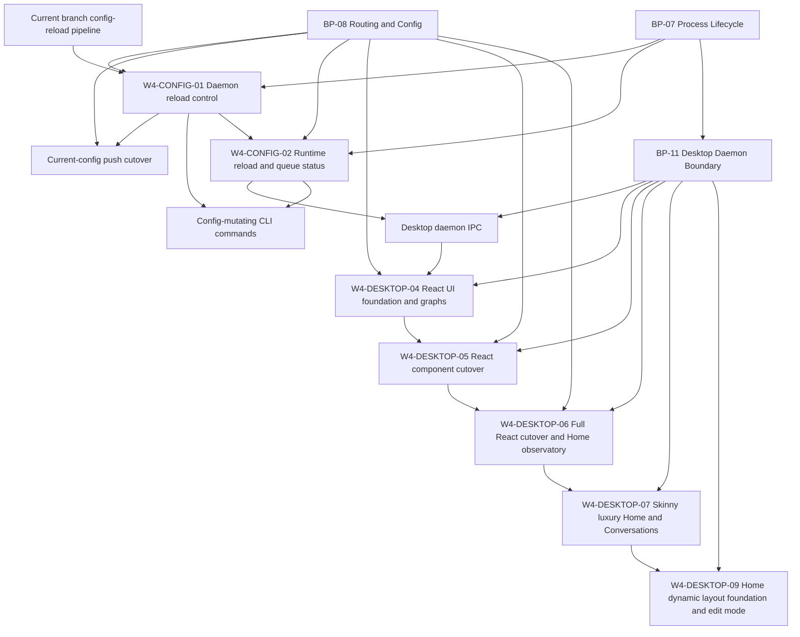

# Jin Execution Program

Updated: 2026-05-24
Branch: jin-dynamic-layout
Focus: Desktop modular UI and future dynamic layout foundation.

## Current Thesis

Desktop should remain a typed client of the daemon boundary while the UI moves
from a large React/CSS monolith toward surface-owned components and explicit
layout models. Home should preserve useful local observability from daemon view
models while gaining a typed panel registry that can later support user-adjusted
layouts.

## Active Packets

| Packet | Status | Owner | Purpose |
| --- | --- | --- | --- |
| W4-CONFIG-01 | review_ready | worker | Daemon reload control plus current-config push cutover hardening |
| W4-CONFIG-02 | queued | worker | Immutable reload/queue status snapshots for CLI and Desktop |
| W4-DESKTOP-04 | merged | codex-WORKER-desktop-routing-overflow, codex-WORKER-desktop-sidebar-chrome | Stabilize Home/Routing graph UI and Desktop chrome behind typed IPC |
| W4-DESKTOP-05 | merged | codex-WORKER-desktop-react-cutover | Cut Desktop shell, Home, and Routing over to real React components |
| W4-DESKTOP-06 | review_ready | codex-WORKER-desktop-full-react-cutover, codex-WORKER-desktop-visual-fix, codex-WORKER-desktop-snapshot-chart-fix | Remove remaining legacy HTML adapter and populate Home Token & Cost Observatory |
| W4-DESKTOP-07 | review_ready | codex-BRAIN, UX/UI reviewer lanes complete | Skinny luxury overhaul for Home and Conversations, with screenshot-driven design review |
| W4-DESKTOP-09 | review_ready | codex-WORKER-home-dynamic-layout | Review-finding resolution for Home dynamic layout foundation, edit mode, renderer-local layout preferences, and layout-aware panels |

## Dependency Graph

## Coordination Rules

- W4-CONFIG-01 owns command apply and daemon reload route behavior.
- W4-CONFIG-02 owns status DTOs and runtime queue/reload visibility.
- W4-DESKTOP-04 owns Desktop renderer/UI graph stabilization only.
- W4-DESKTOP-06 owns removing the remaining legacy Desktop HTML adapter and
  making Home charts resilient without daemon/API contract changes.
- W4-DESKTOP-07 owns Home/Conversations visual-system iteration and screenshot
  artifacts only. It must not change Desktop daemon API contracts or runtime
  behavior.
- W4-DESKTOP-09 owns the active dynamic layout lane for Home, including the
  layout foundation, edit mode, renderer-local preferences, and layout-aware
  panels. It may use `react-grid-layout/core` behind the data-only adapter and
  renderer `localStorage` for layout preferences, but must not adopt package
  DOM/CSS, add Desktop IPC preference storage, or touch daemon/API contracts.
- Do not change Desktop renderer code in config packets.
- Do not change runtime, pipeline, sink, DB, or route matching behavior in W4-DESKTOP-04.
- Do not change runtime, pipeline, sink, DB, API contract, or route matching
  behavior in W4-DESKTOP-06.
- Stop and update BP-07/BP-08 before implementing any contract extension that conflicts with frozen blueprint language.

## Latest Status

- Commit `edf91a6` landed W4-DESKTOP-04 and W4-DESKTOP-05: React entry/build,
  React shell/Home/Routing, typed Desktop logs/routing IPC, BP-11, and Home image
  prompt docs.
- W4-DESKTOP-06 implementation is review-ready with clean final source review:
  Conversations, Logs, and
  Settings are React-rendered surfaces, `desktop/legacy-entry.ts` is removed,
  Home Mission Control and Token & Cost Observatory reserve visible graph space,
  snapshot aggregate usage renders as a full-width distribution band without
  double-counting totals, and the sidebar cost `(i)` affordance opens on hover,
  focus, and click.
- Parent validation and final reviewer validation on 2026-05-16 passed
  `bun run desktop:typecheck`, focused
  Desktop renderer/shell/home route tests, `bun run desktop:build`, and
  `git diff --check`. Live Electron visual verification is still pending because
  Computer Use returned `codex app-server exited before returning a response`
  and reviewer Electron smoke exited with `SIGABRT`.
- 2026-05-17 checkpoint commit `3c24a09` saved current screenshot/reference
  artifacts before the W4-DESKTOP-07 visual revamp. Computer Use can now inspect
  the Electron window, with occasional stale accessibility-tree snapshots after
  HMR.
- W4-DESKTOP-07 is review-ready. UX/UI reviewers found clipped Conversations
  rows, over-heavy Home cards, noisy project labels, and bulky detail/inspector
  chrome. The folded iteration removes Home collapsed Stats bars, slims the
  metric/action/chart surfaces, normalizes project/conversation labels, densifies
  Conversations rows/messages/inspector, and saves Home/Conversations screenshots
  through iteration 4 under `docs/execution/artifacts/W4-DESKTOP-07/`. Validation
  passed `bun run desktop:typecheck`, focused Desktop tests, and
  `bun run desktop:build`.
- W4-DESKTOP-09 review findings were resolved on 2026-05-24. The active dynamic layout
  lane now has the single packet of record plus capsule, worker prompt, review
  prompt, and live heartbeat. It covers the Home panel registry and
  `DashboardGrid` seam, RGL core adapter, Home edit mode with renderer-local
  storage, and layout-aware Home panels. Resolution validation passed
  `bun run desktop:typecheck`, focused Desktop layout/renderer/shell tests,
  `bun run desktop:build`, `git diff --check`, and a built-artifact scan for
  forbidden RGL renderer/style dependencies. The P1 row-overflow overlap
  invariant is fixed in the grid adapter, provider-backed edit lifecycle tests
  cover explicit Save/Cancel behavior, and stacked breakpoint context is now
  represented in panel render context. Computer Use attaches and confirms
  read-only/edit-mode accessibility state; resized-state screenshot evidence is
  still a follow-up visual artifact because screenshots are stale relative to
  the accessibility tree during HMR.

## Exit Criteria

- Packets and prompts exist for both lanes.
- W4-CONFIG-01 has implementation, tests, and review.
- W4-CONFIG-02 has implementation or an approved narrowed follow-up if status shape requires council review.
- `bun run typecheck`, CI unit matrix, release gates, focused reload/push tests, and temp-binary acceptance pass.
