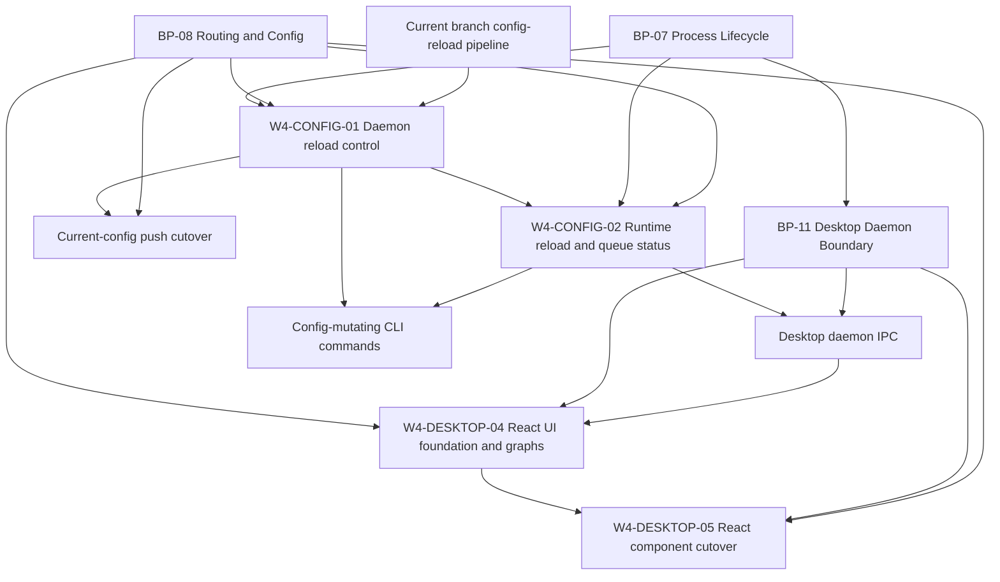

# Jin Execution Program

Updated: 2026-05-16
Branch: current Desktop dirty workspace
Focus: Desktop UI foundation, Home/Routing graph stabilization, and typed daemon IPC review.

## Current Thesis

Desktop should remain a typed client of the daemon boundary while the UI moves
from ad hoc renderer strings/CSS into a durable React/component foundation.
Graph work should visualize existing local data and routing semantics without
changing runtime, pipeline, sink, or route behavior.

## Active Packets

| Packet | Status | Owner | Purpose |
| --- | --- | --- | --- |
| W4-CONFIG-01 | review_ready | worker | Daemon reload control plus current-config push cutover hardening |
| W4-CONFIG-02 | queued | worker | Immutable reload/queue status snapshots for CLI and Desktop |
| W4-DESKTOP-04 | in_progress | codex-WORKER-desktop-routing-overflow, codex-WORKER-desktop-sidebar-chrome | Stabilize Home/Routing graph UI and Desktop chrome behind typed IPC |
| W4-DESKTOP-05 | in_progress | codex-WORKER-desktop-react-cutover | Cut Desktop shell, Home, and Routing over to real React components |

## Dependency Graph

## Coordination Rules

- W4-CONFIG-01 owns command apply and daemon reload route behavior.
- W4-CONFIG-02 owns status DTOs and runtime queue/reload visibility.
- W4-DESKTOP-04 owns Desktop renderer/UI graph stabilization only.
- Do not change Desktop renderer code in config packets.
- Do not change runtime, pipeline, sink, DB, or route matching behavior in W4-DESKTOP-04.
- Stop and update BP-07/BP-08 before implementing any contract extension that conflicts with frozen blueprint language.

## Latest Status

- W4-DESKTOP-04 was opened because the Desktop renderer has a partial graph patch and currently fails `bun run desktop:typecheck`.
- The package cut is approved and installed: React component seam, Radix primitives, `lucide-react`, Recharts, `@xyflow/react`, and `d3-shape` / `d3-sankey`.
- Excluded for this packet: MUI, Three.js, Tailwind, and shadcn CLI.
- The worker must restore compile health before visual polish and then move newly touched graph surfaces behind React components or a narrow typed React seam.
- `codex-WORKER-desktop-routing-overflow` owns the live screenshot text overflow/clipping fix for the Routing graph.
- `codex-WORKER-desktop-sidebar-chrome` owns the sidebar runtime metric cleanup and duplicate Routing refresh removal.
- `codex-WORKER-desktop-react-cutover` owns moving the Desktop shell, Home, and Routing across the React component seam while preserving typed daemon IPC and W4-DESKTOP-04 behavior.

## Exit Criteria

- Packets and prompts exist for both lanes.
- W4-CONFIG-01 has implementation, tests, and review.
- W4-CONFIG-02 has implementation or an approved narrowed follow-up if status shape requires council review.
- `bun run typecheck`, CI unit matrix, release gates, focused reload/push tests, and temp-binary acceptance pass.
