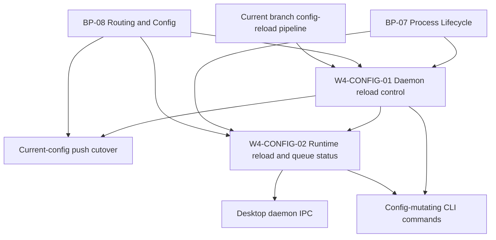

# Jin Execution Program

Updated: 2026-05-14
Branch: `fix/config-mutation-boundary-19`
Focus: Config mutation boundary hardening after Desktop daemon IPC review.

## Current Thesis

Config-mutating CLI commands should not rely on indirect file watching as their primary apply path. They should write durable config, then ask the single running daemon to reload through the local API/socket boundary. File watching remains a compatibility and manual-edit fallback.

## Active Packets

| Packet | Status | Owner | Purpose |
| --- | --- | --- | --- |
| W4-CONFIG-01 | review_ready | worker | Daemon reload control plus current-config push cutover hardening |
| W4-CONFIG-02 | queued | worker | Immutable reload/queue status snapshots for CLI and Desktop |

## Dependency Graph

## Coordination Rules

- W4-CONFIG-01 owns command apply and daemon reload route behavior.
- W4-CONFIG-02 owns status DTOs and runtime queue/reload visibility.
- Do not change Desktop renderer code in either packet.
- Stop and update BP-07/BP-08 before implementing any contract extension that conflicts with frozen blueprint language.

## Latest Status

- W4-CONFIG-01 is review-ready after owner review follow-ups were patched and validated.
- Resolved review findings: sink enable/disable no longer mutates runtime pause state directly, config mutations cross the local daemon reload boundary, startup/reload strict validation rejects malformed generations, fatal reload shutdown skips stale final-flush, and active sink-disable checks at push batch boundaries.
- Current patch result: config mutations use `--restart` for explicit full recycle, sink health checks run outside the config lock, successful config reload enqueues push, and push batches re-check current config routes/sinks before egress plus avoid recording local success across generation changes.
- W4-CONFIG-02 should land after W4-CONFIG-01 so status can preserve the accepted-vs-completed distinction.
- Huygens completed read-only design review for W4-CONFIG-02; recommended queue/reload snapshot fields were copied into the packet.

## Exit Criteria

- Packets and prompts exist for both lanes.
- W4-CONFIG-01 has implementation, tests, and review.
- W4-CONFIG-02 has implementation or an approved narrowed follow-up if status shape requires council review.
- `bun run typecheck`, CI unit matrix, release gates, focused reload/push tests, and temp-binary acceptance pass.
