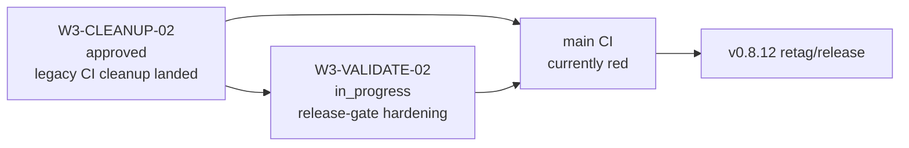

# Program State

- phase: `release recovery`
- current date: `2026-05-03`
- current focus: `finish release-gate cleanup while queueing W3-BP-02 for a second live-config-cutover council pass`

## TL;DR

## Packet State

- archived packet state: `.execution/archive/packets/`
- live packets:
  - `W3-CLEANUP-02` — `approved`
  - `W3-VALIDATE-02` — `in_progress`
  - `W3-BP-02` — `approved`
  - `W3-SINK-04` — `needs_codex`
  - `W3-E2E-01` — `review_ready`
  - `W3-SERVICE-01` — `blocked`
  - `W3-PR-01` — `blocked`
- historical nonterminal packet files from the old Wave 3 rollout remain in
  `.execution/packets/` for now and should be normalized or archived in a
  second pass:
  - `W3-ADAPTER-08`
  - `W3-DOCS-01`
  - `W3-PERF-04`
  - `W3-PERF-07`
  - `W3-PERF-09`
  - `W3-PERF-10`
  - `W3-PERF-11`
  - `W3-SINK-05`
  - `W3-UI-01`

## Active Agents

- `codex-BRAIN`
- `codex-WORKER-release-gate-hardening`

Archived historical heartbeats live under:

- `.execution/archive/agents/`

## Next Dispatches

- drive `W3-VALIDATE-02` to review-ready from the cleaned baseline
- resume `#19` implementation from the approved W3-BP-02 contract
- reconcile `W3-SINK-04` once release-path CI noise is gone
- retag/release only after `main` CI is green again

## Blockers

- `main` CI is red on stale legacy release/unit surfaces
- release `v0.8.12` must not be tagged until cleanup + validation hardening land
- `.execution/blueprints.md` still reflects pre-merge `W3-SINK-06` / `W3-TEAM-03`
  state and needs a separate reviewer-owned refresh

## Notes

- terminal packet-state files were archived to `.execution/archive/packets/`
- stale tmp diagrams were moved to `docs/execution/archive/tmp-diagram/`
- `docs/execution/tasks/` and `docs/execution/prompts/` were intentionally left
  in place for now because they are still referenced by historical audits and
  reviews; archive/migration of those docs should be a separate pass
