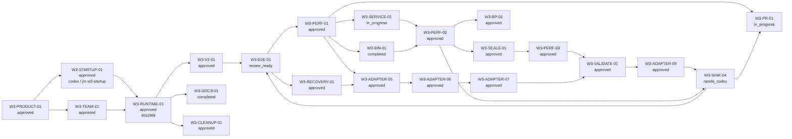

# Program State

- phase: `Wave 3 integration`
- current date: `2026-04-09`
- current focus: `W3-ADAPTER-09 is approved; open the Cursor null-bundle / DB-open follow-up next, then rerun live validation, then reconcile sinks, then move to workspace-member / userId work`

## TL;DR

## Packet State

- `W0-CODEX-01` — `approved`
- `W0-CURSOR-01` — `approved`
- `W0-CODEX-02` — `approved`
- `W1-DB-01` — `approved`
- `W1-ROUTING-01` — `approved`
- `W1-SINK-01` — `approved`
- `W1-LIFECYCLE-01` — `approved`
- `W1-PIPE-01` — `approved`
- `W2-CONFIG-02` — `approved`
- `W2-CMD-01` — `approved`
- `W1-ADAPTER-01` — `approved`
- `W2-SINK-02` — `approved`
- `W2-SINK-03` — `approved`
- `W2-DAEMON-02` — `approved`
- `W2-ADAPTER-02` — `approved`
- `W2-ADAPTER-03` — `approved`
- `W2-ADAPTER-04` — `approved`
- `W2-PIPE-02` — `approved`
- `W3-MODULE-01` — `approved`
- `W3-PRODUCT-01` — `approved`
- `W3-STARTUP-01` — `approved`
- `W3-TEAM-01` — `approved`
- `W3-RUNTIME-01` — `approved`
- `W3-V2-01` — `approved`
- `W3-DOCS-01` — `completed`
- `W3-E2E-01` — `review_ready`
- `W3-PERF-01` — `approved`
- `W3-PERF-02` — `approved`
- `W3-PERF-03` — `approved`
- `W3-SCALE-01` — `approved`
- `W3-BP-01` — `approved`
- `W3-RECOVERY-01` — `approved`
- `W3-ADAPTER-05` — `approved`
- `W3-ADAPTER-06` — `approved`
- `W3-ADAPTER-07` — `approved`
- `W3-ADAPTER-08` — `queued`
- `W3-ADAPTER-09` — `approved`
- `W3-VALIDATE-01` — `approved`
- `W3-SINK-04` — `needs_codex`
- `W3-SINK-05` — `queued`
- `W3-BIN-01` — `completed`
- `W3-SERVICE-01` — `in_progress`
- `W3-CLEANUP-01` — `approved`
- `W3-PR-01` — `in_progress`
- `W3-UI-01` — `blocked`

## Active Agents

- `codex-BRAIN` (backing heartbeat: `codex-control-plane-01.md`)
- `codex-WORKER-pipeline-spine` (backing heartbeat: `codex-WORKER-pipeline-spine.md`, available for reassignment)
- `codex-WORKER-config-mutation-control` (backing heartbeat: `codex-WORKER-config-mutation-control.md`, available for reassignment)
- `codex-WORKER-read-only-query-surface` (backing heartbeat: `codex-WORKER-read-only-query-surface.md`, available for reassignment)
- `codex-WORKER-postgres-reference-sink` (backing heartbeat: `codex-WORKER-postgres-reference-sink.md`, available for reassignment)
- `codex-WORKER-s3-reference-sink` (backing heartbeat: `codex-WORKER-s3-reference-sink.md`, available for reassignment)
- `codex-WORKER-claude-code-reference-adapter` (backing heartbeat: `codex-WORKER-claude-code-reference-adapter.md`, available for reassignment)
- `codex-WORKER-local-control-boundary` (backing heartbeat: `codex-WORKER-local-control-boundary.md`, available for reassignment)
- `codex-WORKER-cursor-reference-adapter` (backing heartbeat: `codex-WORKER-cursor-reference-adapter.md`, available for reassignment)
- `codex-WORKER-codex-reference-adapter` (backing heartbeat: `codex-WORKER-codex-reference-adapter.md`, available for reassignment)
- `codex-WORKER-simple-adapters-bulk-port` (backing heartbeat: `codex-WORKER-simple-adapters-bulk-port.md`, available for reassignment after the approved handoff)
- `codex-WORKER-pipeline-spec-gap-closure` (backing heartbeat: `codex-WORKER-pipeline-spec-gap-closure.md`, available for reassignment after the approved handoff)
- `codex-WORKER-protected-source-opt-in` (backing heartbeat: `codex-WORKER-protected-source-opt-in.md`, external Codex session id: `019d6526-e1e2-7962-9d3e-f349f954a4d1`, tmux session: `jin-w3-startup`, log: `.execution/logs/codex-W3-STARTUP-01.jsonl`)
- `codex-WORKER-live-runtime-store-cutover` (backing heartbeat: `codex-WORKER-live-runtime-store-cutover.md`, internal Codex agent id: `019d65e7-b587-7121-b09b-73b302251361`, nickname: `Mendel`)
- `codex-WORKER-runtime-store-evidence-gap` (backing heartbeat: `codex-WORKER-runtime-store-evidence-gap.md`, internal Codex agent id: `019d6a25-e747-7302-ac13-0f9d5be74702`, nickname: `Confucius`)
- `codex-REVIEWER-runtime-store-cutover-recheck` (external Codex session id: `019d6a2c-6ae8-7ec3-bd29-5ed0a74e630b`, tmux session: `jin-review-w3-runtime-codex`, log: `.execution/logs/codex-REVIEWER-runtime-store-cutover-recheck.jsonl`)
- `codex-WORKER-v2-final-steps` (external Codex session id: `019d6a2f-7241-7443-b5b5-61f426a612c3`, tmux session: `jin-w3-v2`, log: `.execution/logs/codex-WORKER-v2-final-steps.jsonl`)
- `codex-WORKER-experimental-reset-install-doc` (external Codex session id: `019d6a34-83cd-7382-9858-156c910ec0cc`, tmux session: `jin-w3-docs`, log: `.execution/logs/codex-WORKER-experimental-reset-install-doc.jsonl`)
- `codex-REVIEWER-v2-final-steps` (external Codex session id: `019d6a3b-7cd0-7fe3-be33-a8999c69035a`, tmux session: `jin-review-w3-v2-codex`, log: `.execution/logs/codex-REVIEWER-v2-final-steps.jsonl`)
- `codex-WORKER-v2-final-steps-recheck` (external Codex session id: `019d6a43-f48f-79a3-a9ce-213ea563a10d`, tmux session: `jin-w3-v2-recheck`, log: `.execution/logs/codex-WORKER-v2-final-steps-recheck.jsonl`)
- `codex-REVIEWER-v2-final-steps-recheck` (external Codex session id: `019d6a49-5a76-7a92-a013-9c544bd4a1eb`, tmux session: `jin-review-w3-v2-codex`, log: `.execution/logs/codex-REVIEWER-v2-final-steps-recheck.jsonl`)
- `codex-WORKER-persona-e2e-local-postgres` (external Codex session id: `019d6a53-3671-75b0-b359-94a839bb4213`, tmux session: `jin-w3-e2e`, log: `.execution/logs/codex-WORKER-persona-e2e-local-postgres.jsonl`)
- `codex-WORKER-codex-ingest-rss-budget` (external Codex session id: `019d6b08-9516-7191-aaf6-06962b7b8b8e`, tmux session: `jin-w3-perf`, log: `.execution/logs/codex-WORKER-codex-ingest-rss-budget.jsonl`)
- `codex-WORKER-codex-ingest-rss-budget-recheck` (external Codex session id: `019d6b39-53b0-7e03-8251-06d503e5bfd6`, tmux session: `jin-w3-perf-recheck`, log: `.execution/logs/codex-WORKER-codex-ingest-rss-budget-recheck.jsonl`)
- `codex-WORKER-poisoned-local-store-recovery` (external Codex session id: `019d6b08-9516-7ce3-9dcc-474b25320499`, tmux session: `jin-w3-recovery`, log: `.execution/logs/codex-WORKER-poisoned-local-store-recovery.jsonl`)
- `codex-EXPLORER-adapter-memory-gap` (internal Codex agent id: `019d6b22-4d56-7e41-849e-e1e8ef41b030`, nickname: `Beauvoir`)
- `codex-WORKER-postgres-push-regression` (backing heartbeat: `codex-WORKER-postgres-push-regression.md`, external Codex log: `.execution/logs/codex-WORKER-postgres-push-regression.jsonl`, tmux session: `not persisted`)
- `codex-REVIEWER-codex-ingest-rss-budget` (external Codex session id: `019d6b47-2a65-7780-b644-717e1ded2a32`, tmux session: `jin-review-w3-perf-codex`, log: `.execution/logs/codex-REVIEWER-codex-ingest-rss-budget-recheck.jsonl`)
- `codex-REVIEWER-poisoned-local-store-recovery` (external Codex session id: `019d6b2a-1562-7201-ad16-c8dc751a15fe`, tmux session: `jin-review-w3-recovery-codex`, log: `.execution/logs/codex-REVIEWER-poisoned-local-store-recovery.jsonl`)
- `codex-WORKER-adapter-memory-contract-audit` (external Codex session id: `019d6b2a-1562-7883-8248-93416750b4b0`, tmux session: `jin-w3-adapter-05`, log: `.execution/logs/codex-WORKER-adapter-memory-contract-audit.jsonl`)
- `codex-REVIEWER-adapter-memory-contract-audit` (external Codex session id: `019d6b39-5436-78b1-ac8d-36d471e044dd`, tmux session: `jin-review-w3-adapter-05-codex`, log: `.execution/logs/codex-REVIEWER-adapter-memory-contract-audit.jsonl`)
- `codex-WORKER-claude-code-memory-hardening` (external Codex session id: `019d6b44-f001-7f53-adee-998c44b1c7f4`, tmux session: `jin-w3-adapter-06`, log: `.execution/logs/codex-WORKER-claude-code-memory-hardening.jsonl`)
- `codex-WORKER-claude-code-live-hardening` (external Codex session id: `019d6f49-1124-77d1-aa81-c141272df282`, tmux session: `jin-w3-adapter-07`, log: `.execution/logs/codex-WORKER-claude-code-live-hardening.jsonl`)
- `codex-WORKER-claude-code-id-collision` (backing heartbeat: `codex-WORKER-claude-code-id-collision.md`, tmux session: `jin-w3-adapter-09`, log: `.execution/logs/codex-WORKER-claude-code-id-collision.jsonl`)
- `codex-REVIEWER-claude-code-id-collision` (backing heartbeat: `codex-REVIEWER-claude-code-id-collision.md`, external Codex session id: `019d7513-3071-75f3-9692-4f5f5eb0b39f`, tmux session: `jin-review-w3-adapter-09-codex`, log: `.execution/logs/codex-REVIEWER-claude-code-id-collision.jsonl`)
- `codex-VERIFIER-claude-code-id-collision` (backing heartbeat: `codex-VERIFIER-claude-code-id-collision.md`, external Codex session id: `019d7513-30f7-7423-8e12-814309f33357`, tmux session: `jin-verify-w3-adapter-09-codex`, log: `.execution/logs/codex-VERIFIER-claude-code-id-collision.jsonl`, Claude stream log: `.execution/logs/claude-VERIFIER-claude-code-id-collision.stream.jsonl`)
- `codex-WORKER-local-binary-smoke` (external Codex session id: `019d6b4a-7423-7380-9116-5cc407ea95f4`, tmux session: `jin-w3-bin`, log: `.execution/logs/codex-WORKER-local-binary-smoke.jsonl`)
- `codex-WORKER-local-service-rollout` (tmux session: `jin-w3-service`, log: `.execution/logs/codex-WORKER-local-service-rollout.jsonl`)
- `codex-WORKER-v1-surface-cleanup` (backing heartbeat: `codex-WORKER-v1-surface-cleanup.md`, external Codex session id: `019d702e-c524-78f1-ab5e-b06af95bf512`, tmux session: `jin-w3-cleanup-01`, log: `.execution/logs/codex-WORKER-v1-surface-cleanup.jsonl`)
- `codex-REVIEWER-v1-surface-cleanup` (backing heartbeat: `codex-REVIEWER-v1-surface-cleanup.md`, tmux session: `jin-review-w3-cleanup-codex`, log: `.execution/logs/codex-REVIEWER-v1-surface-cleanup.jsonl`)
- `codex-WORKER-pr-to-main` (tmux session: `jin-w3-pr`, log: `.execution/logs/codex-WORKER-pr-to-main.jsonl`)
- `codex-REVIEWER-claude-code-memory-hardening` (external Codex session id: `019d6b55-c5b4-77b1-abd9-57ab03d4531e`, tmux session: `jin-review-w3-adapter-06-codex`, log: `.execution/logs/codex-REVIEWER-claude-code-memory-hardening.jsonl`)
- `codex-WORKER-full-runtime-rss-shutdown-flush` (external Codex session id: `019d6b6a-1bc4-7353-9c8b-0872070cb87e`, tmux session: `jin-w3-perf-02`, log: `.execution/logs/codex-WORKER-full-runtime-rss-shutdown-flush.jsonl`)
- `codex-WORKER-v2-performance-harness` (external Codex session id: `019d6f38-0a92-74f2-8c18-82a853c81b5f`, tmux session: `jin-w3-perf-03`, log: `.execution/logs/codex-WORKER-v2-performance-harness.jsonl`)
- `codex-WORKER-scale-datasets` (external Codex session id: `019d6f38-09f6-75d0-8607-1ddac0c4dc09`, tmux session: `jin-w3-scale-01`, log: `.execution/logs/codex-WORKER-scale-datasets.jsonl`)
- `codex-WORKER-performance-blueprint` (external Codex session id: `019d6f38-0a92-76c2-ab72-e3d5cd388b87`, tmux session: `jin-w3-bp-01`, log: `.execution/logs/codex-WORKER-performance-blueprint.jsonl`)
- `claude-WORKER-team-bootstrap` (backing heartbeat: `claude-WORKER-team-bootstrap.md`, external Claude session id: `d9a9d3a5-92d7-4acd-9ce8-d6b561860508`, tmux session: `jin-w3-team`, log: `.execution/logs/claude-WORKER-team-bootstrap.stream.jsonl`)
- `codex-REVIEWER-protected-source-opt-in` (external Codex session id: `019d6547-510c-7040-9a91-c89ba0a31216`, tmux session: `jin-review-w3-startup-codex`, log: `.execution/logs/codex-REVIEWER-protected-source-opt-in.jsonl`)
- `claude-REVIEWER-protected-source-opt-in` (external Claude session id: `f73c120c-540f-4056-a99b-fc71ec688e4d`, tmux session: `jin-review-w3-startup-claude`, log: `.execution/logs/claude-REVIEWER-protected-source-opt-in.stream.jsonl`)
- `codex-REVIEWER-team-bootstrap` (external Codex session id: `019d65a5-6d4e-7470-805b-c84c902c0ab4`, tmux session: `jin-review-w3-team-codex`, log: `.execution/logs/codex-REVIEWER-team-bootstrap.jsonl`)
- `codex-REVIEWER-team-bootstrap-recheck` (external Codex session id: `019d65bb-cc30-7ce1-a56f-458dd10fffd5`, tmux session: `jin-review-w3-team-codex`, log: `.execution/logs/codex-REVIEWER-team-bootstrap-recheck.jsonl`)
- `claude-AUDIT-bp-product` (external Claude session id: `c1377fe1-6b4b-4b82-bf7b-85583c5a594d`, tmux session: `jin-audit-bp-product-claude`, log: `.execution/logs/claude-AUDIT-bp-product.stream.jsonl`)
- `claude-AUDIT-bp-runtime` (external Claude session id: `4acff318-ac8f-464e-83cb-1c0a3d5b6022`, tmux session: `jin-audit-bp-runtime-claude`, log: `.execution/logs/claude-AUDIT-bp-runtime.stream.jsonl`)
- `claude-AUDIT-bp-sinks` (external Claude session id: `1faadffb-b12d-4641-bf43-1b80324228d1`, tmux session: `jin-audit-bp-sinks-claude`, log: `.execution/logs/claude-AUDIT-bp-sinks.stream.jsonl`)
- `claude-AUDIT-bp-config` (external Claude session id: `b14ef4f7-7561-4ee9-8955-f24ba8ea20cd`, tmux session: `jin-audit-bp-config-claude`, log: `.execution/logs/claude-AUDIT-bp-config.stream.jsonl`)
- `claude-AUDIT-bp-product-cli-boundaries` (external Claude session id: `b64e9b4a-67d9-4444-b431-74796a6bf1d5`, tmux session: `jin-audit-bp-product`, log: `.execution/logs/claude-AUDIT-bp-product-cli-boundaries.stream.jsonl`)
- `claude-AUDIT-bp-runtime-store-cutover` (external Claude session id: `991ad26b-6fc6-4924-b598-169831274dfb`, tmux session: `jin-audit-bp-runtime`, log: `.execution/logs/claude-AUDIT-bp-runtime-store-cutover.stream.jsonl`)
- `claude-AUDIT-bp-adapters-sinks` (external Claude session id: `e30ff72b-8070-4a6c-9f75-4969bda9da7b`, tmux session: `jin-audit-bp-adapters`, log: `.execution/logs/claude-AUDIT-bp-adapters-sinks.stream.jsonl`)
- `claude-AUDIT-bp-config-startup-api` (external Claude session id: `8abd917c-097d-477f-9e24-3674d00cc756`, tmux session: `jin-audit-bp-config`, log: `.execution/logs/claude-AUDIT-bp-config-startup-api.stream.jsonl`)

## Next Dispatches

- use the approved `W3-CLEANUP-01` cleanup baseline to keep new work off the removed UI / v1 surfaces
- open and execute the Cursor null-bundle / DB-open follow-up next, then rerun live validation
- reconcile `W3-VALIDATE-01` follow-on state after the Cursor lane lands
- reconcile `W3-SINK-04` after the adapter follow-ups unless sink proof is needed sooner for a release decision
- keep `W3-SINK-05` queued as a later observability lane for per-sink routed/synced/pending/error stats in `jin status`
- dispatch `W3-ADAPTER-08` only if the Claude functional fix needs the internal split to stay safe and reviewable
- review `W3-E2E-01` once runtime is stable again
- execute `W3-SERVICE-01` follow-up validation once sink delivery and live validation are stable
- execute `W3-PR-01` from the approved baseline once runtime is stable again
- start workspace-member / `userId` modeling only after Claude, Cursor, and sink follow-ups are narrowed or closed
- keep `W3-UI-01` blocked unless we need the original narrow UI-only slice again

## Blockers

- no semantic blocker remains on `W0-CODEX-02`; the review finding in `01-dispatch-protocol.md` is fixed and the packet is approved
- `W1-DB-01` is approved; three ontology mismatches remain informational only: `tool_calls` composite PK, `tool_calls.duration_ms` default `0`, and no per-message `est_cost` column
- `W1-ROUTING-01` is approved with one remaining non-blocking follow-up: keep the parsing-layer legacy type extensions confined to `normalizeConfig()`; the legacy `sinksForSession()` bridge was removed during `W3-MODULE-01`
- `W1-SINK-01` is approved; the explicit legacy bridge in `src/sinks/webhook.ts` and a few non-critical test gaps remain informational only
- `W1-LIFECYCLE-01` is approved after the recheck dismissed the stale sink attribution and confirmed 5/5 acceptance checks with `test/lifecycle-boundary.test.ts`
- `W1-PIPE-01` is approved; queue coalescing, serial ingest/push, watcher integration, and bounded shutdown flush are all in place, with only hardening items deferred
- `W2-CONFIG-02`, `W2-CMD-01`, `W2-SINK-02`, `W2-SINK-03`, and `W1-ADAPTER-01` are approved; their remaining findings are informational bridges, naming choices, test-hardening follow-ups, or BP-06 warning/bridge notes
- `W2-DAEMON-02` is approved; the daemon boundary delegates control actions through the CLI, preserves single-owner runtime rules, reports stopped/running/degraded status without creating a second runtime, and no longer carries the `createRoutes(store)` compatibility bridge after `W3-MODULE-01`
- `W2-ADAPTER-02` is approved; the Codex adapter now validates BP-04 on a second complex source format with deterministic IDs, compaction splitting, spawned linkage, and mixed tool-call extraction
- `W2-ADAPTER-03` is approved after the fix pass resolved the frozen `toolUses` contract mismatch, removed the unsafe casts, and passed focused tests plus packet-local typecheck
- `W2-SINK-02` is approved after the handshake re-review confirmed permission/auth failures on `jin_meta` now surface the real error, the regression test is in place, and BP-06 readiness semantics still hold
- `W2-ADAPTER-04` is approved; all 10 adapters are now validated against BP-04, with the remaining notes limited to informational cleanup around silent catches, utility duplication, performance polish, and legacy bridge methods
- `W2-PIPE-02` is approved; per-call adapter timeouts, RSS warning/hard-limit enforcement, and disabled-sink filtering are now in the v2 pipeline path, with only consecutive error tracking left as a BP-02 hardening follow-up
- the `CPUQuota=10%` mismatch in `src/commands/service.ts` remains a separate daemon/service follow-up and is intentionally out of scope for `W2-PIPE-02`
- all Wave 2 packets are now approved; `W3-PRODUCT-01` is approved and the next Wave 3 decision is startup/privacy hardening versus narrower bridge-cleanup packets
- `W3-MODULE-01` is approved; the daemon/watcher module moves and the `sinksForSession()` / `createRoutes(store)` bridge removals were re-reviewed cleanly after the BP Acceptance Matrix and V1 Comparison were backfilled
- `W3-PRODUCT-01` is approved on the 2026-04-05 re-review: no blocking findings remain; 45 focused tests plus CLI help checks passed, BP-07 and BP-08 are now mostly aligned, and BP-Product is aligned with the remaining legacy store/adapter/session surfaces explicitly deferred as compatibility follow-ups
- `W3-STARTUP-01` is approved from the Codex review artifact `2026-04-06-W3-STARTUP-01-codex`; focused startup/config/init/adapter tests reran cleanly, and the only remaining notes are informational drift around `detectAdapters()` and the retained `jin init` compatibility save
- `W3-TEAM-01` is approved on the 2026-04-06 Codex re-review and committed in `b6428cf`; `jin team schema apply` now keeps operators inside `jin team`, `BP-09` is aligned, and the next release-facing work has moved to runtime/store cutover plus E2E prep
- `W3-RUNTIME-01` is approved on `2026-04-07-W3-RUNTIME-01-codex-recheck`; the main remaining BP-05 caveat is the explicit `src/tui/app.tsx` `LegacyStore` defer
- `W3-V2-01` review completed on `2026-04-07` and returned `needs_codex` for docs-only drift: the checklist still starts from a stale pre-approval runtime state even though `W3-RUNTIME-01` is already approved and committed in `45529f8`
- `W3-V2-01` is approved on `2026-04-07-W3-V2-01-codex-recheck`; the final-steps checklist now starts from runtime already approved and committed in `45529f8`, keeps the binary rebuild/install path explicit, and preserves the BP-09 operator/developer split plus preview caveats
- `W3-E2E-01` is `review_ready`; the operator/bootstrap and developer onboarding paths are validated with Docker Postgres and focused tests, but the lane surfaced two concrete blockers outside packet scope: Codex ingest exceeds the 256 MB RSS hard limit on a real dataset, and the post-crash local SQLite store can enter a poisoned WAL/readonly state that requires an experimental hard reset
- `W3-SCALE-01` is approved and now defines the deterministic `1x` / `10x` / `100x` rich-adapter dataset surface for future perf and scale validation
- `W3-BP-01` is approved and adds `BP-10` as the explicit release-validation contract while hardening BP-01/BP-02/BP-04 around it
- `W3-PERF-02` is approved; the narrow recheck removed the `JIN_RSS_WARNING_MB` / `JIN_RSS_HARD_LIMIT_MB` passthrough from `watch.ts`, preserved the frozen BP-02 guard, refreshed the audit wording, and reran focused runtime/store tests cleanly
- `W3-PERF-03` is approved; the narrow recheck now hard-fails when requested adapters disappear, normalizes `highWaterMarkBytes` into byte-valued release artifacts, refreshed the packet-local runbook/audit, and reran focused harness tests plus a wrapper proof run
- `W3-ADAPTER-07` is approved; the lane fixed Claude default-path precedence, removed the live child-recursion / stack-overflow failure, added focused tests and a packet-local audit, and left the remaining `~812 MB` full-dataset pressure explicitly documented as a separate contract/runtime follow-up
- `W3-ADAPTER-09` is approved on `2026-04-09-W3-ADAPTER-09-codex`; detached review matched the worker handoff with `13/13` focused tests passing, `919` refs -> `919` unique loaded conversation IDs, `0` duplicate IDs, `0` cross-conversation/internal message-ID collisions, and a clean audit-cited `919`-write disposable-store run
- `W3-VALIDATE-01` is approved on `2026-04-08-W3-VALIDATE-01-codex`; the reusable live-data sanity harness now cleanly validates Codex and leaves two narrow follow-ups: Claude Code duplicate IDs / `messages.id` collisions, and Cursor null bundles / DB-open failure
- `W3-SINK-04` is `needs_codex` after code review: the Bun SQL `sql.begin(...)` transport fix and focused regression coverage are in place, but approval still needs an unrestricted clean-start rerun that records local SQLite counts, local+Railway row counts, and representative `_jin_push_state` success rows
- repo-wide typecheck still fails in legacy files outside these packet boundaries; later Wave 1 and Wave 2 packets need to absorb that integration debt
