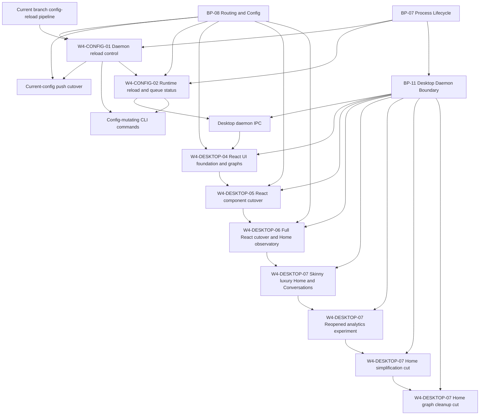

# Jin Execution Program

Updated: 2026-05-17
Branch: main
Focus: Desktop Home graph cleanup ready for review after live visual inspection.

## Current Thesis

Desktop should remain a typed client of the daemon boundary while the UI moves
fully out of ad hoc renderer strings into React components. Home should render
useful local observability from the daemon view models even when a specific
timeline series is absent. The next layer is a skinny, high-density,
Stripe/Linear-like Desktop UI with Apple-style material polish.

## Active Packets

| Packet | Status | Owner | Purpose |
| --- | --- | --- | --- |
| W4-CONFIG-01 | review_ready | worker | Daemon reload control plus current-config push cutover hardening |
| W4-CONFIG-02 | queued | worker | Immutable reload/queue status snapshots for CLI and Desktop |
| W4-DESKTOP-04 | merged | codex-WORKER-desktop-routing-overflow, codex-WORKER-desktop-sidebar-chrome | Stabilize Home/Routing graph UI and Desktop chrome behind typed IPC |
| W4-DESKTOP-05 | merged | codex-WORKER-desktop-react-cutover | Cut Desktop shell, Home, and Routing over to real React components |
| W4-DESKTOP-06 | review_ready | codex-WORKER-desktop-full-react-cutover, codex-WORKER-desktop-visual-fix, codex-WORKER-desktop-snapshot-chart-fix | Remove remaining legacy HTML adapter and populate Home Token & Cost Observatory |
| W4-DESKTOP-07 | review_ready | codex-BRAIN integration | Home graph simplified: Recharts-only chart, duplicate row aggregation, and monthly-ready history window |

## Dependency Graph

## Coordination Rules

- W4-CONFIG-01 owns command apply and daemon reload route behavior.
- W4-CONFIG-02 owns status DTOs and runtime queue/reload visibility.
- W4-DESKTOP-04 owns Desktop renderer/UI graph stabilization only.
- W4-DESKTOP-06 owns removing the remaining legacy Desktop HTML adapter and
  making Home charts resilient without daemon/API contract changes.
- W4-DESKTOP-07 owns Home/Conversations visual-system iteration and screenshot
  artifacts only. It must not change Desktop daemon API contracts or runtime
  behavior. Its reopened experiment must use existing Desktop view-model data
  only: top-row Conversation filters, collapsible metadata, and richer Home
  analytics are UI composition changes, not daemon/API changes.
- The Home simplification cut must remove unclear Signals/Recents panels,
  dedupe Home totals, and add graph period/window controls using existing
  `DesktopHomeData` only. Workers/reviewers do not use Computer Use; main-thread
  `codex-BRAIN` owns live Electron visual verification.
- The Home graph cleanup cut may edit `src/api/routes.ts` only to increase the
  existing Desktop Home `tokenUsageByDay` history window; it must not add new
  endpoint shapes, IPC calls, contract fields, or daemon behavior.
- Do not change Desktop renderer code in config packets.
- Do not change runtime, pipeline, sink, DB, or route matching behavior in W4-DESKTOP-04.
- Do not change runtime, pipeline, sink, DB, API contract, or route matching
  behavior in W4-DESKTOP-06.
- Stop and update BP-07/BP-08 before implementing any contract extension that conflicts with frozen blueprint language.

## Latest Status

- Commit `edf91a6` landed W4-DESKTOP-04 and W4-DESKTOP-05: React entry/build,
  React shell/Home/Routing, typed Desktop logs/routing IPC, BP-11, and Home image
  prompt docs.
- W4-DESKTOP-06 implementation is review-ready with clean final source review:
  Conversations, Logs, and
  Settings are React-rendered surfaces, `desktop/legacy-entry.ts` is removed,
  Home Mission Control and Token & Cost Observatory reserve visible graph space,
  snapshot aggregate usage renders as a full-width distribution band without
  double-counting totals, and the sidebar cost `(i)` affordance opens on hover,
  focus, and click.
- Parent validation and final reviewer validation on 2026-05-16 passed
  `bun run desktop:typecheck`, focused
  Desktop renderer/shell/home route tests, `bun run desktop:build`, and
  `git diff --check`. Live Electron visual verification is still pending because
  Computer Use returned `codex app-server exited before returning a response`
  and reviewer Electron smoke exited with `SIGABRT`.
- 2026-05-17 checkpoint commit `3c24a09` saved current screenshot/reference
  artifacts before the W4-DESKTOP-07 visual revamp. Computer Use can now inspect
  the Electron window, with occasional stale accessibility-tree snapshots after
  HMR.
- W4-DESKTOP-07 Home simplification removed Signals/Recents and added period
  controls. Main-thread Computer Use then found the graph still rendered the old
  static SVG fallback under Recharts. `codex-BRAIN` stopped the slow cleanup
  worker and integrated the cleanup directly: removed the static SVG fallback,
  aggregated duplicate day/adapter rows, increased the existing Home token
  history window to 365 days, and verified the live Home graph no longer shows
  duplicate/clipped x-axis labels. Focused Desktop validation is green.

## Exit Criteria

- Packets and prompts exist for both lanes.
- W4-CONFIG-01 has implementation, tests, and review.
- W4-CONFIG-02 has implementation or an approved narrowed follow-up if status shape requires council review.
- `bun run typecheck`, CI unit matrix, release gates, focused reload/push tests, and temp-binary acceptance pass.
