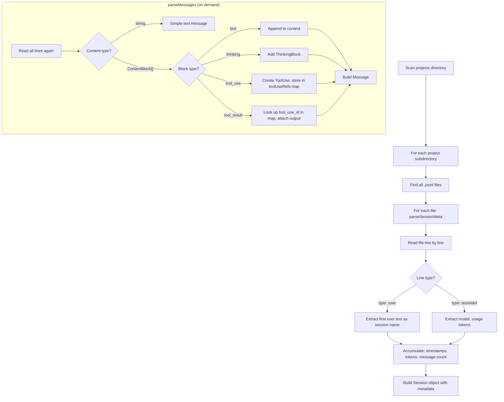
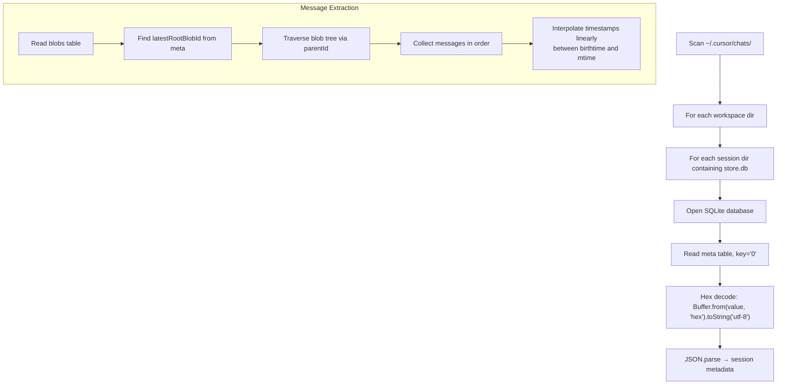
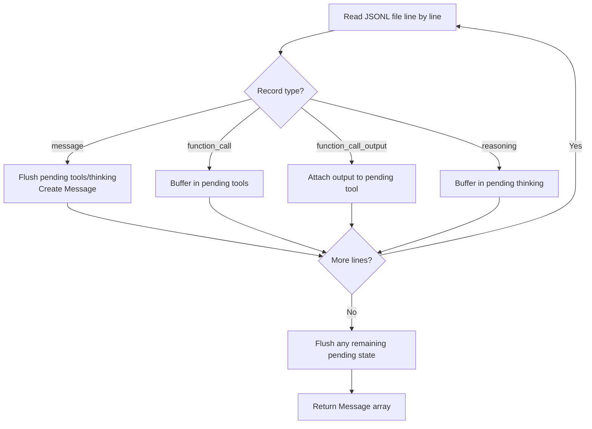

# Adapters Deep Dive — How jin reads 10 coding tools

Each adapter is a self-contained module that knows how to find, parse, and normalize conversations from a specific coding tool. This document covers every adapter's internals.

---

## Adapter Interface

```mermaid
classDiagram
    class Adapter {
        <<interface>>
        +id: string
        +name: string
        +detect() Promise~boolean~
        +sessions() Promise~Session[]~
        +messages(sessionId: string) Promise~Message[]~
        +watchPaths() string[]
    }

    class Session {
        +id: string
        +name: string
        +adapterId: string
        +adapterName: string
        +createdAt: string
        +updatedAt: string
        +durationMs: number
        +isActive: boolean
        +totalTokens: number
        +estCost: number
        +messageCount: number
        +sourcePath: string
        +isSubAgent: boolean
        +metadata: Record
    }

    class Message {
        +id: string
        +role: string
        +content: string
        +timestamp: string
        +model: string
        +inputTokens: number
        +outputTokens: number
        +cacheRead: number
        +cacheWrite: number
        +toolUses: ToolUse[]
        +thinkingBlocks: ThinkingBlock[]
    }

    class ToolUse {
        +id: string
        +name: string
        +input: string
        +output: string
    }

    class ThinkingBlock {
        +content: string
        +tokens: number
    }

    Adapter ..> Session : produces
    Adapter ..> Message : produces
    Message *-- ToolUse
    Message *-- ThinkingBlock
```



---

## Summary Table

| Adapter | Format | Location | Token Tracking | Complexity |
|---------|--------|----------|---------------|------------|
| Claude Code | JSONL | `~/.claude/projects/` or `~/.config/claude/projects/` | Full (input, output, cache read, cache write) | High |
| Cursor | SQLite | `~/.cursor/chats/{workspace}/{session}/store.db` | None | High |
| Codex | JSONL | `~/.codex/sessions/` | Partial | Medium |
| Warp | SQLite | Platform-specific `warp.sqlite` | None | Medium |
| Gemini CLI | JSON | `~/.gemini/tmp/session-*.json` | None | Low |
| Kiro | SQLite | `~/.kiro/data.sqlite3` + fallbacks | None | Medium |
| Amp | JSONL | `~/.local/share/amp/threads/` | Basic | Low |
| OpenCode | JSON/JSONL | `~/.local/share/opencode/storage/` | None | Low |
| Pi | JSONL | `~/.openclaw/agents/main/sessions/` | Basic | Low |
| PiAgent | JSONL | `~/.pi/agent/sessions/` | Basic | Low |

---

## 1. Claude Code (most complex)

**File format:** JSONL — one JSON object per line, each representing a conversational turn.

**Paths:**
- Modern (v1.0.30+): `~/.config/claude/projects/{project-slug}/{session-id}.jsonl`
- Legacy: `~/.claude/projects/{project-slug}/{session-id}.jsonl`
- Sub-agents: `agent-{session-id}.jsonl` prefix

### Parsing Flow



### Key Parsing Challenges

**Content blocks vs strings:** A message's content can be either a plain string or an array of typed content blocks (`text`, `thinking`, `tool_use`, `tool_result`). The adapter handles both.

**Tool use linking:** When the assistant calls a tool, it emits a `tool_use` block with an `id`. The corresponding result comes later as a `tool_result` block with a `tool_use_id` referencing the original. The adapter maintains a `toolUseRefs` map to link them:

```
assistant message:  { type: "tool_use", id: "toolu_abc", name: "Read", input: {...} }
    ↓ stored in map: toolUseRefs["toolu_abc"] = toolUse
user message:       { type: "tool_result", tool_use_id: "toolu_abc", content: "file contents..." }
    ↓ looked up:    toolUseRefs["toolu_abc"].output = "file contents..."
```

**Thinking blocks:** Claude's extended thinking appears as `{ type: "thinking", thinking: "..." }` content blocks. Token count is estimated as `Math.ceil(text.length / 4)`.

**Cache tokens:** Claude Code tracks four token categories: `input_tokens`, `output_tokens`, `cache_creation_input_tokens`, `cache_read_input_tokens`. All four feed into cost estimation.

**Sub-agents:** Files prefixed with `agent-` are sub-agent conversations spawned by the Task tool. They're marked with `isSubAgent: true`.

---

## 2. Cursor

**File format:** SQLite with hex-encoded JSON metadata and a blob tree for messages.

**Path:** `~/.cursor/chats/{workspace-id}/{session-id}/store.db`

### Parsing Flow



### Key Parsing Challenges

**Hex-encoded metadata:** The `meta` table stores values as hexadecimal strings of UTF-8 JSON. Decoding requires `Buffer.from(hex, "hex").toString("utf-8")`.

**Blob tree traversal:** Messages are stored as linked blobs. Each blob has a `parentId` pointing to its predecessor. The adapter starts from `latestRootBlobId` and recursively collects all blobs.

**Timestamp interpolation:** Individual messages don't have timestamps. The adapter distributes them linearly between the file's birth time and modification time.

---

## 3. Codex

**File format:** JSONL with multiple record types.

**Path:** `~/.codex/sessions/{session-id}.jsonl`

### Parsing Flow



### Key Parsing Challenge

**State machine with pending flush:** Tool calls and reasoning blocks arrive as separate records BEFORE the message they belong to. The adapter buffers them in `pendingTools` and `pendingThinking` arrays, then flushes them onto the next `message` record. If the file ends with pending state, a synthetic assistant message is created.

---

## 4. Warp

**File format:** SQLite with structured tables.

**Paths (platform-specific):**
- macOS: `~/Library/Group Containers/.../warp.sqlite`
- Linux: `~/.local/state/warp-terminal/warp.sqlite`
- Windows: `$LOCALAPPDATA/warp/Warp/data/warp.sqlite`

**Table:** `ai_queries` — each row is a query/response pair.

**Sessions:** Grouped by `working_directory`. Each directory becomes a "session" containing all AI queries made in that context.

**ANSI stripping:** Query and response text contain terminal escape codes (`\x1b[...m`). The adapter strips them with a regex.

---

## 5. Gemini CLI

**File format:** JSON (one file per session).

**Path:** `~/.gemini/tmp/session-*.json`

**Flexible structure:** The adapter handles multiple possible field names for the turns array: `turns`, `messages`, or `conversation`. Content can be a string or an array of `parts` objects.

---

## 6. Kiro

**File format:** SQLite with dynamic table discovery.

**Paths:** `~/.kiro/data.sqlite3`, plus macOS and XDG fallbacks, plus legacy `~/.amazonq/data.sqlite3`.

**Dynamic schema:** Instead of hardcoding table names, Kiro queries `sqlite_master` at runtime to discover what tables exist. It tries `conversations`, `sessions`, `chats` for the session table, and similarly discovers the messages table with flexible foreign key resolution.

---

## 7. Amp

**File format:** JSONL.

**Path:** `~/.local/share/amp/threads/{thread-id}.jsonl` (respects `AMP_DATA_HOME` env var).

**Tool calls:** Supports OpenAI-style `tool_calls` arrays with `function.name` and `function.arguments`.

---

## 8. OpenCode

**File format:** JSON or JSONL (tries both).

**Path:** `~/.local/share/opencode/storage/` (Linux) or `~/Library/Application Support/opencode/storage/` (macOS).

**Dual format:** Tries to parse each file as JSON first. If that fails, falls back to JSONL (line-by-line). This handles tools that changed formats between versions.

---

## 9. Pi (OpenClaw)

**File format:** JSONL.

**Path:** `~/.openclaw/agents/main/sessions/{session-id}.jsonl`

**Flexible fields:** Accepts both `role` and `type` for message role, and both `content` directly and nested `message.content`.

---

## 10. PiAgent

**File format:** JSONL.

**Path:** `~/.pi/agent/sessions/{session-id}.jsonl`

Nearly identical to the Pi adapter with a different base directory.

---

## Adding a New Adapter

1. Create `src/adapters/yourtool.ts` implementing the `Adapter` interface
2. Register it in `src/adapters/registry.ts`
3. Test with `jin init` (should detect) and `jin ingest` (should parse)

See `contributing/ADDING_ADAPTERS.md` for a step-by-step guide with skeleton code.
