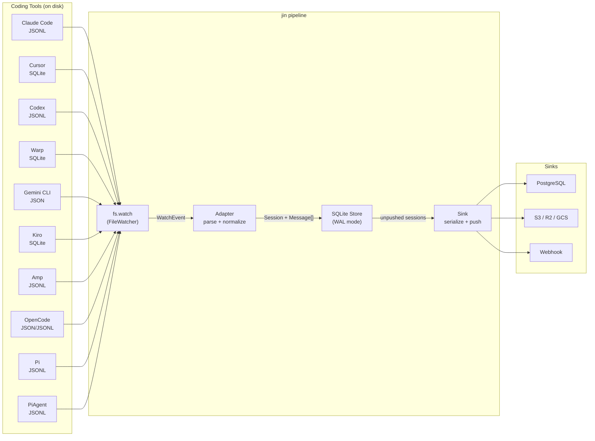
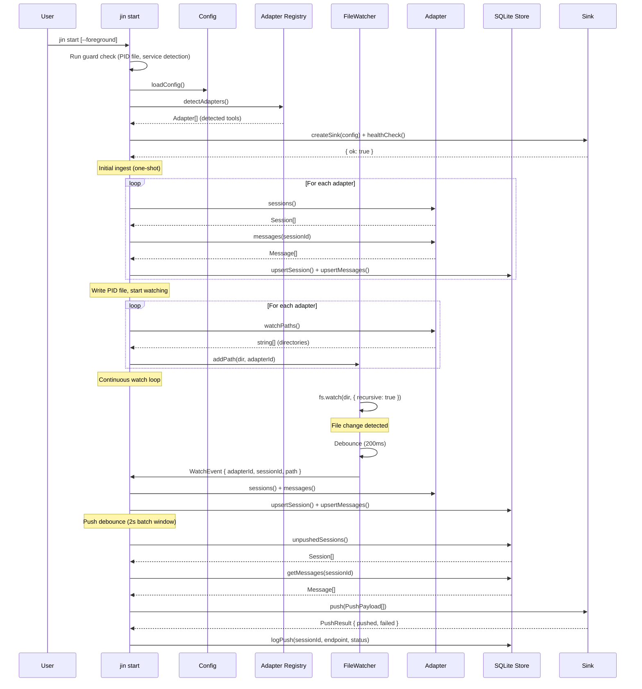
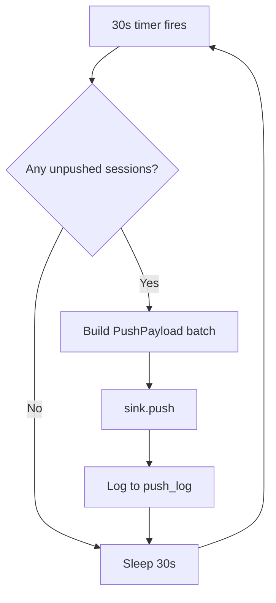

# Data Flow — How data moves through jin

This document traces the complete lifecycle of a conversation from a coding tool's raw file on disk through jin's pipeline to a remote sink.

---

## High-Level Flow



---

## What happens when you run `jin start`

This is the core loop. Here is the exact sequence of operations:



---

## Stage-by-Stage Breakdown

### Stage 1: File System Watching

**Source:** `src/watcher.ts`

The `FileWatcher` class wraps Node's `fs.watch()` with recursive mode enabled. Each adapter provides a list of directories to watch via `watchPaths()`.

Key behavior:
- **Recursive**: Watches all subdirectories (important for Claude Code's nested project structure)
- **Debounce**: Groups rapid changes to the same file. A 200ms timer resets on each change; the callback only fires once the file has been quiet for 200ms
- **Event types**: `rename` maps to `session_created`, `change` maps to `session_updated`
- **Keying**: Debounce is keyed by `{adapterId}:{filename}`, so changes to different files are independent

```
File change → debounce timer starts (200ms)
  └── another change to same file → timer resets
  └── 200ms of quiet → WatchEvent emitted
```

### Stage 2: Adapter Parsing

**Source:** `src/adapters/*.ts`

When a `WatchEvent` fires, the watch loop calls the adapter's `sessions()` and `messages()` methods. Each adapter:

1. **Discovers files**: Scans its tool-specific directory for session files
2. **Parses format**: Reads JSONL, SQLite, or JSON depending on the tool
3. **Normalizes**: Converts tool-specific structures into the unified `Session` and `Message` types
4. **Estimates cost**: For tools that report token usage (Claude Code, Codex), calls `estimateCost()` from `src/pricing.ts`

The output is always the same shape regardless of input tool:

```typescript
interface Session {
  id: string;
  name: string;           // First user message or tool-provided title
  adapterId: string;      // "claude-code", "cursor", etc.
  adapterName: string;    // "Claude Code", "Cursor", etc.
  createdAt: string;      // ISO timestamp
  updatedAt: string;
  durationMs: number;
  isActive: boolean;      // Modified < 5 min ago
  totalTokens: number;
  estCost: number;        // USD
  messageCount: number;
  sourcePath: string;     // Original file on disk
  isSubAgent: boolean;    // Claude Code agent- prefix
  metadata: Record<string, unknown>;
}

interface Message {
  id: string;
  role: "user" | "assistant" | "system" | "tool";
  content: string;
  timestamp: string;
  model: string;
  inputTokens: number;
  outputTokens: number;
  cacheRead: number;      // Cache read tokens
  cacheWrite: number;     // Cache write tokens
  toolUses: ToolUse[];
  thinkingBlocks: ThinkingBlock[];
}
```

### Stage 3: Local Store (SQLite)

**Source:** `src/store.ts`

All normalized data lands in a local SQLite database at `~/.config/jin/store.db`.

Key design decisions:
- **WAL mode**: Write-Ahead Logging for concurrent reads during writes
- **Upsert everywhere**: `INSERT ... ON CONFLICT DO UPDATE` means re-ingesting is idempotent
- **Transactions**: Message batches are wrapped in a transaction for atomicity
- **Foreign keys**: `messages.session_id` references `sessions.id` with `ON DELETE CASCADE`
- **Indexes**: On `adapter_id`, `updated_at`, `session_id`, and `timestamp` for fast queries

Three tables:

| Table | Purpose | Key columns |
|-------|---------|-------------|
| `sessions` | One row per conversation | id, adapter_id, tokens, cost, metadata JSON |
| `messages` | One row per message | session_id FK, role, content, token counts |
| `push_log` | Tracks what's been pushed to which endpoint | session_id, endpoint, status, pushed_at |

### Stage 4: Sink Push

**Source:** `src/sinks/*.ts`, `src/commands/watch.ts`

When the watch loop detects changes, it starts a push debounce timer (2 seconds). This batches multiple rapid file changes into a single push cycle.

The push flow:
1. Query `unpushedSessions()` from the store (sessions not in `push_log` for this sink)
2. For each session, fetch its messages via `getMessages()`
3. Build a `PushPayload[]` array: `{ session, messages }[]`
4. Call `sink.push(payload)` which returns `{ pushed, failed, errors }`
5. Log each successful push to `push_log` so it won't be pushed again

Additionally, a periodic sync runs every 30 seconds as a safety net, catching anything the event-driven push might have missed.

---

## Periodic Sync (Safety Net)



This ensures data reaches sinks even if:
- A file change event was missed (fs.watch is not 100% reliable)
- The push debounce was interrupted by a shutdown
- New sessions were created while the push was in flight
