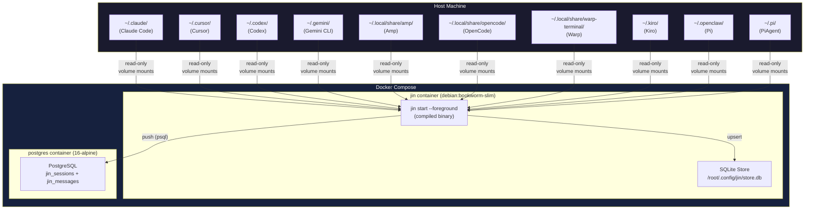
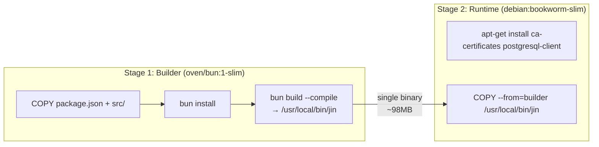
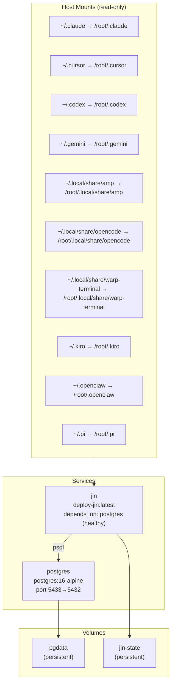
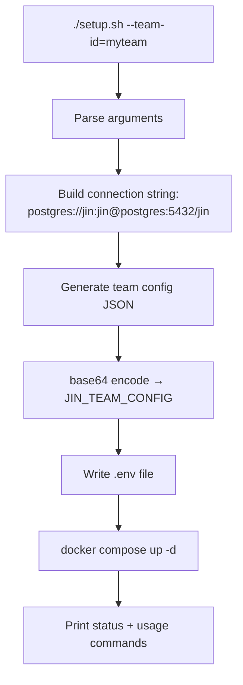

# Deployment — Container Hosting and Self-Hosting

This document covers how jin is packaged and deployed in Docker containers, and how the self-hosted deployment works.

---

## Architecture



---

## Multi-Stage Dockerfile

**Source:** `deploy/Dockerfile`

The build uses two stages to minimize the final image size:



### Why two stages?

- **Builder stage** (`oven/bun:1-slim`, ~150MB): Has Bun runtime, npm, TypeScript compiler. Needed to `bun install` dependencies and compile the binary. This stage is discarded.
- **Runtime stage** (`debian:bookworm-slim`, ~80MB): Just the OS, CA certificates (for HTTPS), and `postgresql-client` (for the psql-based Postgres sink). The compiled jin binary is self-contained — no Node/Bun runtime needed at runtime.

### Why `postgresql-client`?

The Postgres sink uses `psql` as a subprocess to execute SQL against standard `postgres://` connection strings. This is a trade-off for zero npm dependencies — instead of bundling a Postgres client library, we shell out to `psql`. For HTTP-based Postgres (Neon, Supabase), no `psql` is needed.

### Why `ca-certificates`?

The S3 sink and webhook sink make HTTPS requests. Without CA certificates, TLS verification would fail.

---

## Docker Compose Structure

**Source:** `deploy/docker-compose.yml`



### Key design decisions

**Health check dependency:** The jin container uses `depends_on: postgres: condition: service_healthy`. Postgres reports healthy via `pg_isready -U jin` (checked every 2s, 10 retries). This prevents jin from starting before Postgres is ready to accept connections.

**Read-only mounts:** All tool data directories are mounted as `:ro` (read-only). jin never modifies the original tool data — it only reads it. This means:
- No risk of corrupting your coding tool's data
- jin can safely crash or be killed without side effects
- Multiple jin instances could theoretically read the same data (though our run guards prevent this)

**Persistent volumes:** Two named volumes persist across container restarts:
- `pgdata`: Postgres data directory. Your sessions survive `docker compose down` + `up`.
- `jin-state`: jin's SQLite store, config, logs, and raw file copies.

**Entrypoint override:** The Dockerfile sets `ENTRYPOINT ["jin"]` and `CMD ["start", "--foreground"]`, but the compose file overrides with a shell command that runs `jin init --team=$JIN_TEAM_CONFIG` first, then `exec jin start --foreground`. The `exec` replaces the shell process so jin becomes PID 1 and receives signals properly.

---

## Setup Script

**Source:** `deploy/setup.sh`

The setup script automates the deployment for first-time users:



Note the connection string uses `postgres` as the hostname (not `localhost`), because inside Docker's network, containers reference each other by service name.

---

## Querying the Data

Once deployed, you can query Postgres directly:

```sql
-- How many sessions per tool?
SELECT adapter_name, COUNT(*) as sessions, SUM(message_count) as messages
FROM jin_sessions GROUP BY adapter_name;

-- Top 10 most expensive sessions
SELECT name, adapter_name, est_cost, total_tokens, message_count
FROM jin_sessions ORDER BY est_cost DESC LIMIT 10;

-- All messages from a session
SELECT role, model, content, input_tokens, output_tokens
FROM jin_messages WHERE session_id = 'xxx' ORDER BY timestamp;

-- Cost per developer
SELECT developer_id, SUM(est_cost) as total_cost, COUNT(*) as sessions
FROM jin_sessions GROUP BY developer_id ORDER BY total_cost DESC;

-- Tool calls across all sessions
SELECT session_id, tool_uses::jsonb
FROM jin_messages WHERE tool_uses != '[]' LIMIT 20;
```

Or use jin's own CLI:

```bash
docker compose run --rm --entrypoint jin jin sessions --limit=10
docker compose run --rm --entrypoint jin jin stats
docker compose run --rm --entrypoint jin jin show <session-id>
```

---

## Test Harness vs Deploy

jin has two separate Docker Compose setups:

| | `test-harness/` | `deploy/` |
|---|---|---|
| **Purpose** | E2E testing with real tool containers | Self-hosted production deployment |
| **Tools** | Gemini CLI, Codex, OpenCode containers | Host machine tools (read-only mounts) |
| **Data source** | Tool containers generate test data | Real conversations from your machine |
| **Postgres** | Local, test data | Local or remote, real data |
| **Use case** | Development, CI | Running jin for your team |
