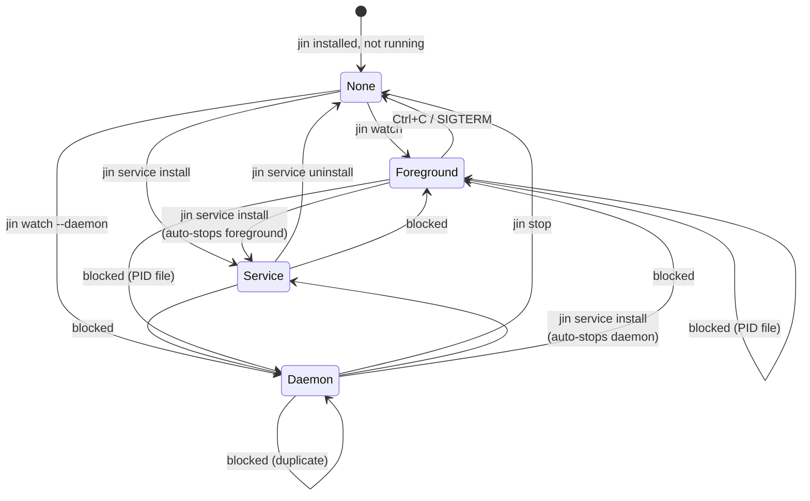
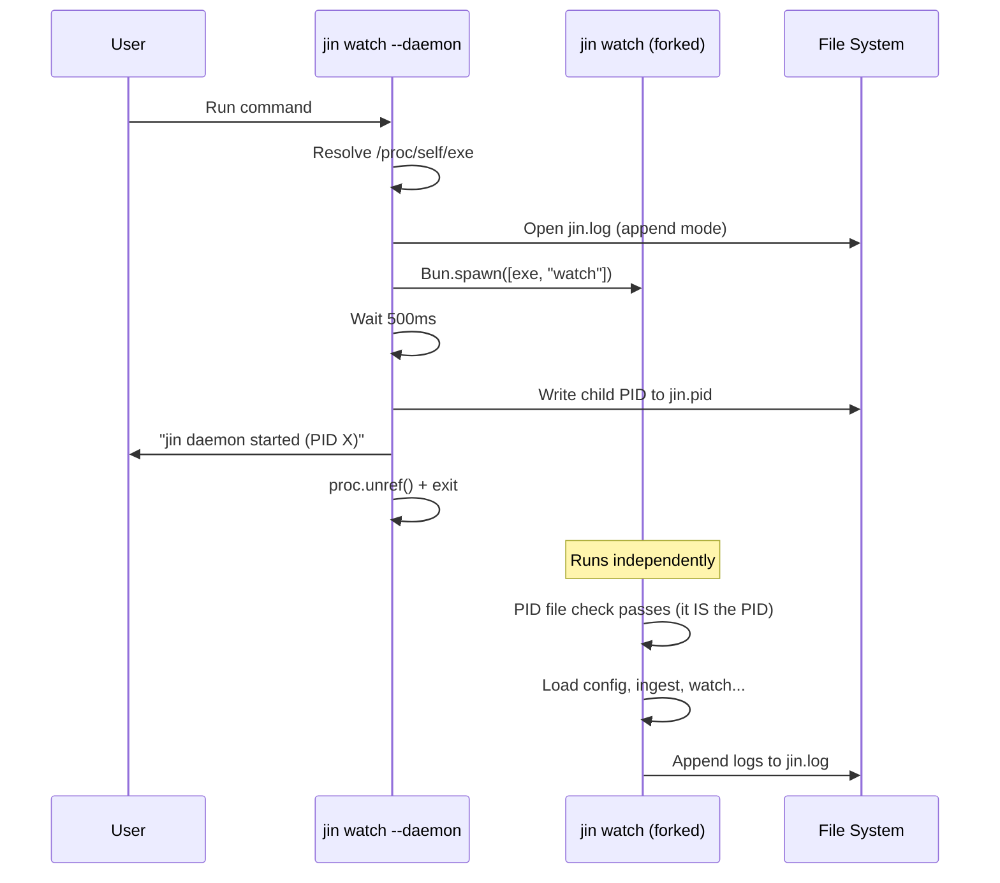
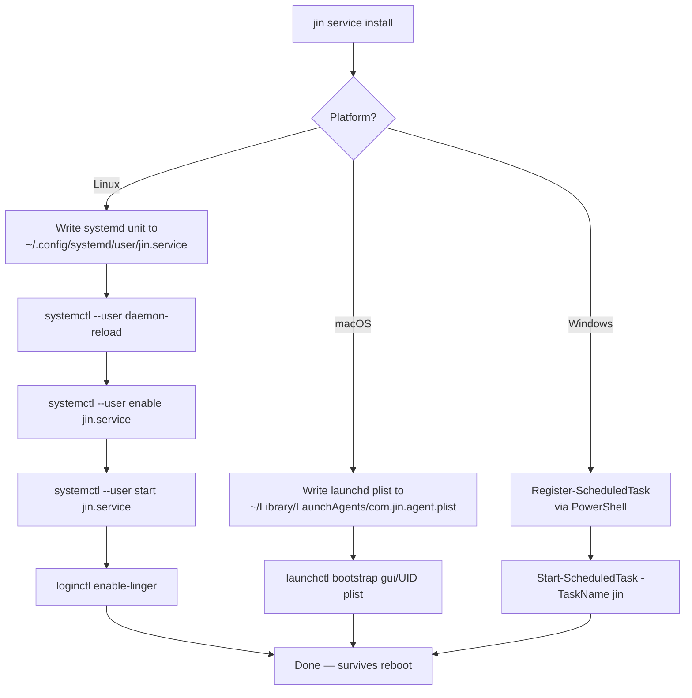
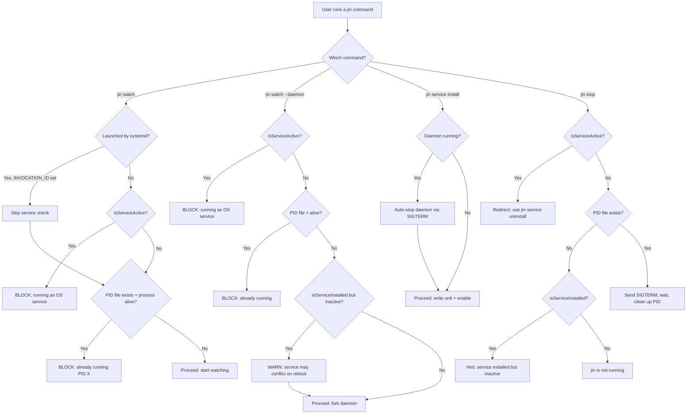

# Run Modes — Daemon, Service, and Run Guards

jin supports three ways to run, with a guard system that prevents them from conflicting. This document covers how each mode works internally and how the conflict prevention logic operates.

---

## Run Mode State Machine



---

## The Three Modes

### 1. Foreground (`jin watch`)

The simplest mode. jin runs in the terminal, logs to stdout, and exits on Ctrl+C.

**Lifecycle:**
1. Run guard check (PID file + service detection)
2. Write PID to `~/.config/jin/jin.pid`
3. Load config, detect adapters, connect sinks
4. Initial ingest
5. Start file watchers
6. Block on `await new Promise(() => {})` (run forever)
7. On SIGTERM/SIGINT: close watchers, close sinks, delete PID file, exit

**When to use:** Debugging, development, one-off testing.

### 2. Daemon (`jin watch --daemon`)

Forks to background and returns control to the terminal.

**Lifecycle:**
1. Run guard check
2. Resolve the real binary path via `/proc/self/exe` (compiled Bun binaries report a virtual `/$bunfs/root/` path — this gets the actual filesystem path)
3. Open log file descriptor: `fs.openSync(LOG_FILE, "a")`
4. Spawn self: `Bun.spawn([exe, "watch"], { stdout: logFd, stderr: logFd, stdin: "ignore" })`
5. Wait 500ms, check `proc.exitCode !== null` (if it already died, report error)
6. Write child PID to `jin.pid`
7. `proc.unref()` — detach from parent, let child run independently
8. Parent exits, child continues running in background



**Key detail — `/proc/self/exe`:** When Bun compiles a binary, `process.argv[0]` returns `/$bunfs/root/jin` (a virtual filesystem path). This is not a real file. To respawn ourselves, we resolve the real path via `fs.realpathSync("/proc/self/exe")` on Linux. On macOS, we fall back to `process.execPath`.

**When to use:** Quick background operation, dev machines, no reboot persistence needed.

### 3. OS Service (`jin service install`)

Registers jin with the operating system's service manager so it auto-starts on boot/login and restarts on crash.



#### Linux: systemd user service

The generated unit file:

```ini
[Unit]
Description=jin — conversation data pipeline for agentic coding tools
After=network-online.target

[Service]
Type=simple
ExecStart=/path/to/jin watch
Restart=on-failure
RestartSec=5s
StandardOutput=append:~/.config/jin/jin.log
StandardError=append:~/.config/jin/jin.log

[Install]
WantedBy=default.target
```

Key points:
- **User-level** (`~/.config/systemd/user/`): No root required
- **`loginctl enable-linger`**: Critical — without this, user services only run while logged in. With linger, they start at boot
- **`Restart=on-failure`**: systemd auto-restarts jin if it crashes (5s delay)
- **Logs**: Appended to `~/.config/jin/jin.log` (not journald, for consistency with daemon mode)

#### macOS: launchd LaunchAgent

The generated plist sets `RunAtLoad: true` and `KeepAlive.SuccessfulExit: false` (restart on crash, not on clean exit).

#### Windows: Task Scheduler

Uses PowerShell's `Register-ScheduledTask` with an `AtLogOn` trigger. No admin required.

**When to use:** Production, set-and-forget, team deployments.

---

## Run Guards — Conflict Prevention

**Source:** `src/runguard.ts`

The run guard system prevents multiple jin instances from running simultaneously, which would cause duplicate data, race conditions on the SQLite store, and duplicate pushes to sinks.

### Decision Flowchart



### The INVOCATION_ID Problem

When `jin service install` registers the systemd unit, systemd runs `jin watch`. But `jin watch` checks `isServiceActive()` which calls `systemctl --user is-active jin.service` — and since the service IS starting (it's running us!), it returns `activating`. This creates a circular block: the service can never start because it blocks itself.

**Fix:** Check for `INVOCATION_ID` or `JOURNAL_STREAM` environment variables, which systemd sets for processes it manages. If present, we know WE are the service, so we skip the service check.

```typescript
const launchedByService = !!(process.env.INVOCATION_ID || process.env.JOURNAL_STREAM);
if (!launchedByService && isServiceActive()) {
  // Block — another service instance is running
}
```

### The Container Problem

In Docker containers, there's no systemd. Calling `Bun.spawnSync(["systemctl", ...])` throws `ENOENT` because the binary doesn't exist. All `isServiceActive()` and `isServiceInstalled()` calls are wrapped in `try/catch` and return `false` on any error.

### Conflict Matrix

| Already running as | User tries | Result |
|---|---|---|
| Daemon | `jin watch` (foreground) | **Blocked**: "already running (PID X)" |
| Daemon | `jin watch --daemon` | **Blocked**: "already running (PID X)" |
| Daemon | `jin service install` | **Auto-stops** daemon, installs service |
| Service | `jin watch` (foreground) | **Blocked**: "running as OS service" |
| Service | `jin watch --daemon` | **Blocked**: "running as OS service" |
| Service | `jin service install` | systemd won't double-start |
| Service | `jin stop` | **Redirects**: "use jin service uninstall" |
| Foreground | `jin watch --daemon` | **Blocked** via PID file |
| Foreground | `jin service install` | **Auto-stops** foreground, installs service |
| None (service installed, inactive) | `jin watch --daemon` | **Warning** about reboot conflict |

---

## Commands

| Command | What it does |
|---------|-------------|
| `jin watch` | Run in foreground (Ctrl+C to stop) |
| `jin watch --daemon` | Fork to background, write PID file |
| `jin service install` | Register with OS service manager |
| `jin service uninstall` | Stop + deregister from OS |
| `jin service status` | Show OS service state |
| `jin status` | Show daemon PID, session counts, sink info, recent logs |
| `jin stop` | Send SIGTERM to daemon PID |
