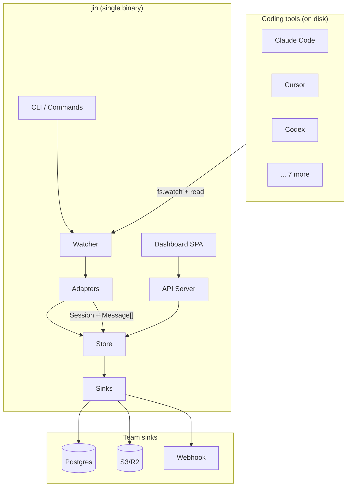
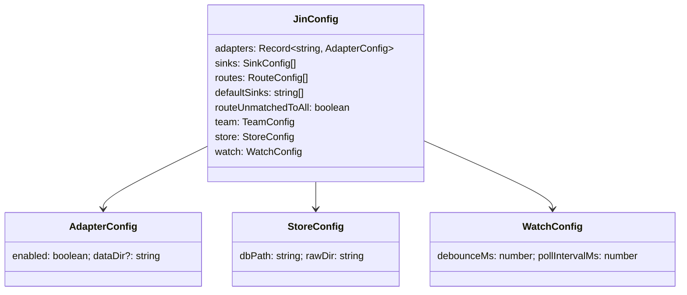
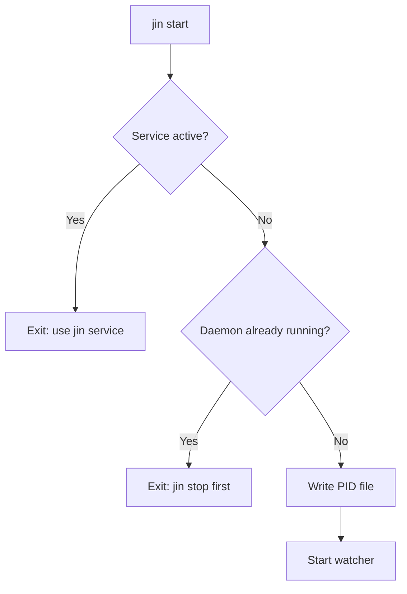
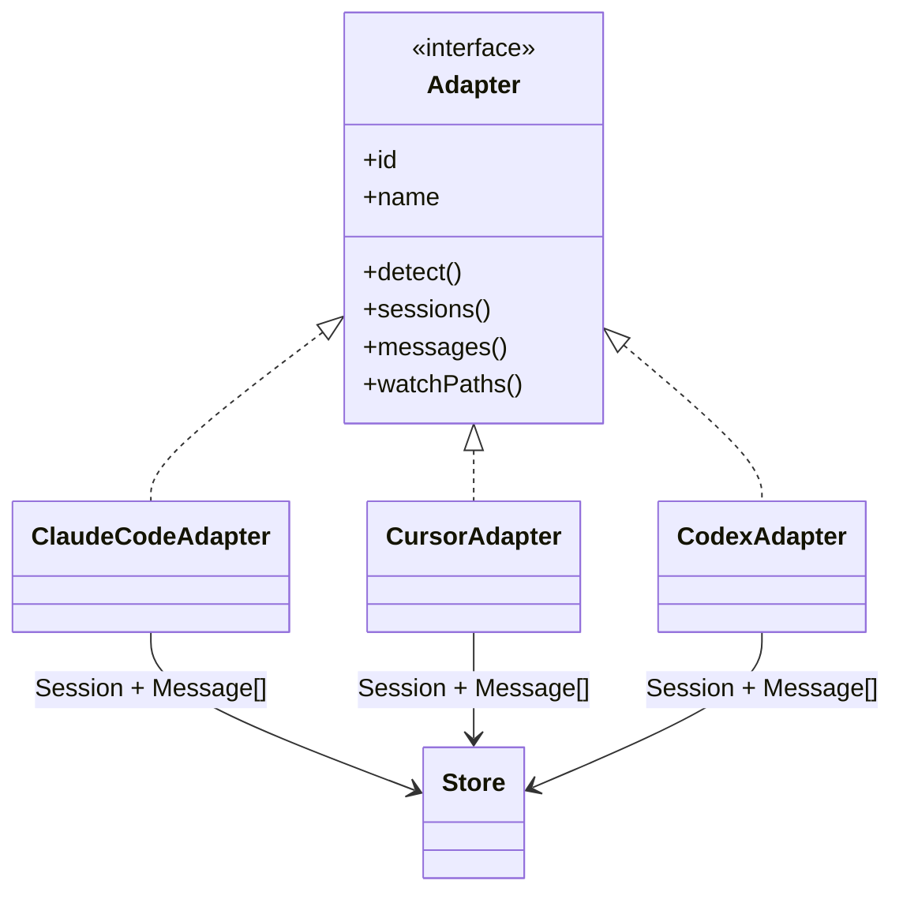
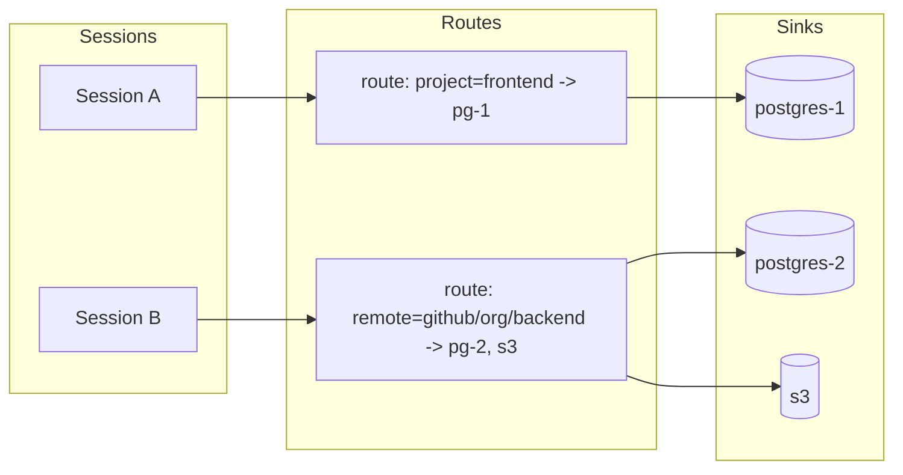

# jin — Interactive Onboarding

A section-by-section walkthrough of the codebase: abstract idea → architecture → components → code pointers → gaps. Use one section at a time and pause for questions.

---

## Section 1: Abstract idea & tech stack

### What jin is

**jin** is a **conversation data pipeline for agentic coding tools**. In one sentence:

> It runs passively in the background, reads conversation data from 10+ coding tools (Claude Code, Cursor, Codex, Warp, Gemini CLI, etc.), normalizes everything into a local SQLite store, and optionally pushes it to team infrastructure (Postgres, S3, webhook).

**Why it exists:**

- **Conversations are the most valuable artifact** — prompts, reasoning, tool calls, and domain decisions live in tool-specific formats and vanish when terminals close.
- **Cost visibility at scale** — teams need per-tool, per-model, per-developer token/cost breakdowns.
- **No behavior change** — no IDE plugins, no wrappers; install, init, and forget.

### Tech stack

| Layer | Choice | Rationale |
|-------|--------|-----------|
| **Runtime** | [Bun](https://bun.sh) | Single binary compile, fast TS execution, built-in SQLite (`bun:sqlite`), no Node/npm at runtime for compiled binary |
| **Language** | TypeScript | Type safety, single codebase for CLI + API |
| **Local DB** | SQLite (WAL) | Zero config, portable, `bun:sqlite` native |
| **CLI** | Hand-rolled in `src/index.ts` | No commander/yargs; `parseFlags()` + `switch (command)` |
| **TUI** | Ink + React | `jin ui --tui` uses React components in terminal |
| **Dashboard** | Vite + React + React Router | SPA embedded at build time via `scripts/embed-spa.ts` |
| **Build** | `bun build --compile` | Single binary output `jin` |

**Key constraint:** The compiled binary must have **zero runtime dependencies** (no `node_modules` at runtime). So the dashboard is **embedded** into the binary as HTML/JS; the API serves it and the SPA talks to `/api/*`.

---

### Diagram — System context



---

**Pause — Section 1.**  
Anything unclear about the problem space or tech choices? Next we’ll go into **overall architecture and data flow**.

---

## Section 2: Architecture & data flow

### High-level data flow

Data moves in one direction: **tool files → adapters → store → sinks**.

```mermaid
flowchart LR
    subgraph Sources
        F1[~/.claude/projects/]
        F2[~/.cursor/...]
        F3[~/.codex/...]
    end

    subgraph Pipeline
        FW[FileWatcher]
        AD[Adapters]
        ST[(SQLite)]
        SK[Sinks]
    end

    subgraph Destinations
        PG[(Postgres)]
        S3[S3]
        WH[Webhook]
    end

    F1 & F2 & F3 --> FW
    FW -->|WatchEvent| AD
    AD -->|Session + Message[]| ST
    ST -->|unpushed sessions| SK
    SK --> PG & S3 & WH
```

**Design decisions:**

1. **Read-only adapters** — jin never writes to or modifies tool data.
2. **Local-first** — everything lands in `~/.config/jin/store.db`; sinks are optional.
3. **fs.watch + polling** — real-time detection with a 30s poll as safety net.
4. **Run guards** — PID file and service checks prevent multiple daemon instances.

### Code pointers — where flow is implemented

| Step | Where |
|------|--------|
| Entry point | `src/index.ts` — `main()`, `switch (command)` |
| Start watcher | `src/commands/start.ts` (daemon) or `src/commands/watch.ts` (foreground) |
| File watching | `src/watcher.ts` — `FileWatcher`, `addPath()`, debounced `onChange` |
| Adapter list | `src/adapters/registry.ts` — `allAdapters()`, `detectAdapters()` |
| Normalized types | `src/adapters/types.ts` — `Session`, `Message`, `ToolUse`, `ThinkingBlock` |
| Persistence | `src/store.ts` — `Store`, `upsertSession()`, `upsertMessages()` |
| Sink creation | `src/sinks/registry.ts` — `createSink(config)` |
| Push orchestration | `src/commands/watch.ts` — `pushToSinks()`, `sinksForSession()` |
| Routing (which sink per session) | `src/routing.ts` — `sinksForSession()`, `matchesRoute()` |

---

**Pause — Section 2.**  
Ready to go deeper into **infrastructure (config, run modes, lifecycle)**?

---

## Section 3: Infrastructure — config, run modes, lifecycle

### Config

- **Location:** `~/.config/jin/config.json` (or `%LOCALAPPDATA%\jin` on Windows).
- **Loaded by:** `src/config.ts` — `loadConfig()`, `configDir()`, `configPath()`.

**Shape (see `JinConfig` in `src/config.ts`):**



- **Defaults:** `defaultConfig()` in `config.ts` enables all adapters, empty sinks, `debounceMs: 5000`, `pollIntervalMs: 30000`.
- **Team onboarding:** `decodeTeamConfig()` / `encodeTeamConfig()` in `src/sinks/types.ts` — base64 JSON of a `SinkConfig` so one paste gives Postgres/S3/webhook.

**Code pointers:**  
`src/config.ts` (full file) — `loadConfig`, `saveConfig`, `defaultConfig`, `configDir`.

---

### Run modes

| Mode | How | Persistence |
|------|-----|-------------|
| **Foreground** | `jin start --foreground` | Runs in terminal; Ctrl+C stops |
| **Daemon** | `jin start` | Forks to background; PID in `~/.config/jin/jin.pid` |
| **OS service** | `jin service install` | systemd / launchd / Task Scheduler |

**Code pointers:**

- Daemon fork: `src/commands/watch.ts` — `daemonize()` (spawns self with `JIN_DAEMON=1`, writes PID file).
- Run guards: `src/runguard.ts` — `isDaemonRunning()`, `isServiceActive()`, `isServiceInstalled()`, `detectRunMode()`.
- Lifecycle (watcher + UI state): `src/lifecycle.ts` — `getWatcherState()`, `getDashboardState()`, `stopAll()`.

---

### Diagram — run guards



---

**Pause — Section 3.**  
Next: **adapters** (interface, registry, and one deep dive).

---

## Section 4: Adapters — interface, registry, example

### Adapter contract

Every adapter implements the same interface so the watcher and ingest loop can treat all tools uniformly.

**Code:** `src/adapters/types.ts`

```typescript
interface Adapter {
  id: string;       // e.g. "claude-code"
  name: string;     // e.g. "Claude Code"
  icon: string;     // single char for CLI

  detect(): Promise<boolean>;                    // is tool data present?
  sessions(): Promise<Session[]>;               // list all sessions
  messages(sessionId: string, sourcePath?: string): Promise<Message[]>;
  watchPaths(): string[];                        // dirs to watch
  artifacts?(): Promise<ContextArtifact[]>;     // optional: memory, rules, etc.
}
```

**Normalized output:**

- **Session** — id, name, adapterId, timestamps, durationMs, isActive, totalTokens, estCost, messageCount, sourcePath, isSubAgent, metadata.
- **Message** — id, role, content, timestamp, model, input/output/cache tokens, toolUses[], thinkingBlocks[].

So each adapter’s job: **discover files → parse tool-specific format → emit `Session[]` and `Message[]`**.

### Registry

**Code:** `src/adapters/registry.ts`

- `allAdapters()` — returns every known adapter instance (10 today).
- `detectAdapters()` — runs `detect()` on each and returns only those that report “present.”

Adapters are **not** pluggable at runtime; they’re imported and registered in code. Adding a tool = add a new file under `src/adapters/` and register it in `registry.ts`.

### Example: Claude Code adapter

**Code:** `src/adapters/claude-code.ts`

- **Data source:** `~/.claude/projects/` or `~/.config/claude/projects/` — per-project dirs with `.jsonl` files.
- **Format:** JSONL lines with `type`, `message`, `usage`, etc.
- **Behavior:**  
  - `detect()` — looks for those dirs and checks for `.jsonl` inside.  
  - `sessions()` — scans projects, parses JSONL to build session metadata (including compaction, sub-agents).  
  - `messages(sessionId, sourcePath)` — reads the JSONL file, normalizes each line to `Message` (tool_use, thinking blocks, token counts).  
  - `watchPaths()` — returns `[projectsDir]`.  
- **Optimization:** `FileOffsetCache` (and similar) used to avoid re-reading entire file when possible (incremental/offset tracking).

Other adapters follow the same pattern; formats differ (SQLite for Cursor/Warp, JSON for Gemini CLI, etc.). See `contributing/ELI5/ADAPTERS_DEEP_DIVE.md` for a table and per-adapter notes.

### Diagram — adapter layer



---

**Pause — Section 4.**  
Next: **Store** (schema, upserts, push_log).

---

## Section 5: Store — schema, operations, push tracking

### Role

Single source of truth for normalized sessions and messages. Used by:

- Watcher (ingest writes here).
- Push loop (reads unpushed sessions, then logs pushes).
- CLI commands (`sessions`, `show`, `stats`, etc.).
- API (dashboard reads from here).
- Search (local FTS or Postgres via sinks).

### Schema (core tables)

**Code:** `src/store.ts` — `SCHEMA` string and migrations.

| Table | Purpose |
|-------|---------|
| **sessions** | One row per conversation: id, adapter_id, name, timestamps, tokens, est_cost, source_path, is_sub_agent, metadata (JSON). |
| **messages** | One row per message: session_id (FK CASCADE), role, content, model, token counts, tool_uses (JSON), thinking_blocks (JSON). |
| **push_log** | Which session was pushed to which endpoint (endpoint, status, pushed_at) — used to compute “sessions needing push.” |

Additional tables (same file):

- **artifacts** — context artifacts (memory, rules, configs) from adapters.
- **projects** — derived from cwd/git; groups sessions.
- **session_projects** — M:N session ↔ project.
- **tags** / **session_tags** — auto and user tags.
- **tool_usage** — per-session tool call stats.

All session/message writes use **upsert** (`INSERT ... ON CONFLICT DO UPDATE`) so re-ingest is idempotent. Message batches run in a transaction.

### Key operations

- **Upsert:** `upsertSession(session)`, `upsertMessages(sessionId, messages)`.
- **Push tracking:** `sessionsNeedingPush(sinkId)` uses `push_log` to find sessions not yet successfully pushed to that sink; `logPush(sessionId, endpoint, status)` after a push.
- **Reads:** `getSession(id)`, `getMessages(id)`, `enrichedSessions()`, `sessionCount()`, `analyzeByAdapter()`, `timelineByDay()`, etc.

**Code pointers:**  
`src/store.ts` — top (SCHEMA), then `Store` class methods.

---

**Pause — Section 5.**  
Next: **Sinks** (interface, registry, routing).

---

## Section 6: Sinks — interface, registry, routing

### Sink contract

**Code:** `src/sinks/types.ts`

```typescript
interface Sink {
  id: string;
  name: string;
  supportsDelta?: boolean;   // if true, sink can merge partial updates

  healthCheck(): Promise<{ ok: boolean; error?: string }>;
  push(data: PushPayload[]): Promise<PushResult>;
  close(): Promise<void>;
}

// PushPayload = { session, messages }[]
// PushResult = { pushed, failed, errors[] }
```

**SinkConfig** is a union: `type: "webhook" | "postgres" | "s3"` plus type-specific fields (url/headers, connectionString, bucket/region/endpoint/keys, etc.).

### Registry and creation

**Code:** `src/sinks/registry.ts`

- `SINK_FACTORIES[type]` — webhook, postgres, s3.
- `createSink(config, index?)` — calls factory, sets `sink.id` from `config.id` or `type-${index}`.

Implementations:

- `src/sinks/webhook.ts` — HTTP POST with JSON.
- `src/sinks/postgres.ts` — libpq, upsert into `jin_sessions` / `jin_messages` (or custom table/schema).
- `src/sinks/s3.ts` — AWS Sig V4 from scratch (no AWS SDK), multipart for large payloads.

### Routing — which sessions go to which sinks

Not every session is pushed to every sink. **Routing** is project-based:

**Code:** `src/routing.ts`

- **Inputs:** session, store (for session→projects), config, all sinks.
- **Behavior:**  
  - If `config.routeUnmatchedToAll` → all sinks.  
  - Else if no `config.routes` → no sinks (opt-in).  
  - Else: for each route, if `matchesRoute(route.match, project)` for any of the session’s projects, use that route’s `sinks` list.  
  - If no route matched, use `config.defaultSinks` (or none).
- **Match criteria:** `RouteMatch` can match by **project** name, **remote** (git URL), or **directory** path.

So: **routes** define “for this project/remote/dir, push to these sink IDs.”  
**Code:** `src/commands/watch.ts` — `pushToSinks()` uses `sinksForSession(session, store, config, allSinks)` to decide targets, then batches and calls `sink.push()`.

### Reverse resolution (for search/show)

When you run `jin show <id>` or `jin search "..."` and the session might be in a **Postgres** sink (e.g. another machine), the CLI needs to know which Postgres sink(s) to query.

**Code:** `src/sink-resolver.ts`

- `resolveSinksForCwd(cwd, config)` — uses same `matchesRoute` + project info (name, directory, git remote) to return which Postgres sinks apply to current directory.
- `findSinkById(sinkId, config)`, `allPostgresSinks(config)` — helpers for explicit sink selection.

---

### Diagram — sink routing



---

**Pause — Section 6.**  
Next: **Watcher and watch loop** (how ingest and push are triggered).

---

## Section 7: Watcher and watch loop

### FileWatcher

**Code:** `src/watcher.ts`

- Wraps `fs.watch(path, { recursive: true })`.
- **Debounce:** per key `adapterId:filename`, reset a timer on each change; after `debounceMs` (config) fire one `WatchEvent`.
- **Event:** `{ type: "session_created" | "session_updated", adapterId, sessionId, timestamp, path }`.

So: one logical “file quiet” event per file, per adapter.

---

### Watcher deep dive — how it actually works

#### 1. What the OS gives you

The watcher uses Node/Bun’s **`fs.watch(path, { recursive: true }, callback)`** (from the `fs` module). That’s a thin wrapper over:

- **macOS:** FSEvents
- **Linux:** inotify
- **Windows:** ReadDirectoryChangesW

When something changes under `path`, the OS notifies the process and the **callback** runs with:

- **`eventType`** — usually `"rename"` (create/delete/move) or `"change"` (content change). jin maps `rename` → `session_created`, `change` → `session_updated`.
- **`filename`** — the **relative** path of the changed file/dir under the watched root (e.g. `project-abc/session.jsonl`).

So one call to `watch("/home/you/.claude/projects", { recursive: true }, ...)` watches that directory and **all subdirectories**. You don’t register each file; you register one root and get events for any file under it.

**Code:** `src/watcher.ts` lines 18–42: `watch(path, { recursive: true }, (eventType, filename) => { ... })`.

---

#### 2. Why debounce?

Tools like Claude Code **append to a JSONL file many times** during a single reply (e.g. every few hundred ms). Without debounce you’d get dozens of events for one “logical” change and re-ingest the same file over and over.

**Debounce** means: “wait until this file has stopped changing for `debounceMs` ms, then emit **one** event.”

- **Key:** `adapterId:filename` (e.g. `claude-code:myproject/chat.jsonl`). So each file has its own timer; changing file A doesn’t affect the timer for file B.
- **On each OS event:** if there’s already a timer for that key, **clear it** and start a new one. When the timer **fires** (no new event for `debounceMs`), emit one `WatchEvent` and delete the timer.

So: **many rapid OS events → one WatchEvent per file** after the file goes quiet.

**Code:** `src/watcher.ts` lines 22–40: `debounceTimers.get(key)`, `clearTimeout`, `setTimeout(..., this.opts.debounceMs)`.

---

#### 3. What gets watched (who calls addPath)

The **watch command** creates one `FileWatcher` and then, for each **adapter**, calls:

```ts
for (const path of adapter.watchPaths()) {
  watcher.addPath(path, adapter.id);
}
```

So you get **one `fs.watch` per (adapter, directory)**. Examples:

- **Claude Code:** `watchPaths()` returns `[~/.claude/projects]` (or `~/.config/claude/projects`) — one recursive watch over the whole projects tree.
- **Cursor:** `[~/.cursor/chats]`.
- **Codex:** `[~/.codex/sessions]`.

Each adapter decides which directories contain session data; the watcher doesn’t know about file extensions or naming — it just watches dirs and forwards events with that adapter’s `id`.

**Code:** `src/commands/watch.ts` lines 229–234. Adapter implementations: e.g. `src/adapters/claude-code.ts` → `watchPaths()` (around line 356), `src/adapters/cursor.ts` → `watchPaths()` (around line 101).

---

#### 4. Building the full path

The OS callback only gives you **`filename`** (relative). To read the file you need an **absolute path**. The watcher does:

```ts
path: `${path}/${filename}`
```

So if `path` was `/home/you/.claude/projects` and `filename` was `myproject/chat.jsonl`, the event’s `path` is `/home/you/.claude/projects/myproject/chat.jsonl`. That string is what the watch command uses to call `ingestSingleFile(adapter, store, event.path)`.

**Code:** `src/watcher.ts` line 37. Note: on Windows, `filename` can sometimes use backslashes; the code uses `/` which is usually acceptable with Node/Bun path handling elsewhere.

---

#### 5. What happens when an event fires (onChange)

The **watch command** passes an **`onChange`** callback when creating the `FileWatcher`. When the debounce timer fires, the watcher calls `this.opts.onChange(watchEvent)`. That callback (in `watch.ts`) does:

1. **Resolve adapter** — find the adapter by `event.adapterId`; if none, return.
2. **Self-observation filter** — if `event.path` is under jin’s own output (log file, store.db, raw dir), **ignore** the event so jin doesn’t react to its own writes.
3. **Per-file cooldown** — if this **exact path** was ingested in the last **5 seconds** (`FILE_COOLDOWN_MS`), skip. This avoids re-ingesting while the tool is still appending (e.g. long stream).
4. **Log** — e.g. `session_updated — Claude Code: chat.jsonl`.
5. **Ingest** — `ingestSingleFile(adapter, store, event.path)`:
   - If the adapter supports it, use `sessionForFile(filePath)` / `newMessages(...)` for a lightweight, single-file update.
   - Otherwise load session for that file and full `adapter.messages(...)`, then `store.upsertSession` + `store.upsertMessages`.
6. **Mark for push** — if a session was ingested, add its id to `pendingPush` and call `schedulePush()` (debounced push to sinks).

So the **watcher** only does “file changed → one event”; **ingest and push** are entirely in the **watch command’s onChange** handler.

**Design note:** An alternative would be an *inclusive* contract: each adapter defines which paths are session files (e.g. “only `*.jsonl` under projects dir”); only those get ingested. That would avoid ingesting tool logs or new files tools add to the same directory, without maintaining an exclusion list. Today the code uses the self-observation exclusion for jin’s output only.

**Code:** `src/commands/watch.ts` lines 202–227 (onChange), 496–546 (`ingestSingleFile`).

---

#### 6. Two debounces (file vs push)

There are **two** debounce layers:

| Layer | Where | Purpose |
|-------|--------|--------|
| **File watcher** | `watcher.ts` | Many OS events for one file → one `WatchEvent` after file is quiet for `debounceMs` (config, e.g. 5s). |
| **Push to sinks** | `watch.ts` | Many ingested sessions → one `pushToSinks()` after no new sessions for `PUSH_DEBOUNCE_MS` (= `debounceMs * 5` or 1s). |

So: file changes are coalesced per file; then push to Postgres/S3/webhook is coalesced over a short window so you don’t send a request per keystroke.

**Code:** `watch.ts` lines 174–188 (`schedulePush`, `PUSH_DEBOUNCE_MS`), and the `onChange` calling `schedulePush()`.

---

#### 7. Periodic sync (safety net)

`fs.watch` is not 100% reliable (e.g. some NFS/network filesystems, or missed events under load). So the watch command also runs a **periodic full ingest** every `pollIntervalMs` (e.g. 30s):

- For each adapter, call `ingestAdapter(...)` (full scan of all sessions).
- Add any newly/changed sessions to `pendingPush` and call `schedulePush()`.

Anything the watcher missed will be picked up within one poll interval.

**Code:** `src/commands/watch.ts` around lines 251–262: `setInterval(..., periodicInterval)`.

---

#### 8. End-to-end diagram (one file change)

```mermaid
sequenceDiagram
    participant OS as OS (inotify/FSEvents)
    participant FW as FileWatcher
    participant Loop as Watch loop (onChange)
    participant Adapter
    participant Store
    participant Sinks

    Note over OS: User saves in Claude Code
    OS->>FW: callback("change", "proj/chat.jsonl")
    FW->>FW: clearTimeout(old), setTimeout(debounceMs)
    Note over FW: ... 5s no more events ...
    FW->>FW: timer fires
    FW->>Loop: onChange(WatchEvent path=.../proj/chat.jsonl)
    Loop->>Loop: cooldown? self-observation?
    Loop->>Adapter: sessionForFile(path) or sessions()
    Adapter->>Loop: Session
    Loop->>Adapter: messages(sessionId, path)
    Adapter->>Loop: Message[]
    Loop->>Store: upsertSession, upsertMessages
    Loop->>Loop: pendingPush.add(id), schedulePush()
    Note over Loop: ... PUSH_DEBOUNCE_MS ...
    Loop->>Store: sessionsNeedingPush(), getMessages()
    Loop->>Sinks: push(PushPayload[])
    Loop->>Store: logPush(...)
```

---

### Watch command (foreground loop)

**Code:** `src/commands/watch.ts` — `watchCommand({ daemon: false })`

High-level sequence:

1. **Run guards** — exit if service or daemon already running (unless we are the service).
2. **Load config, open store**, ensure raw dir exists.
3. **Create sinks** — for each `config.sinks`, `createSink()` + `healthCheck()`; keep only healthy.
4. **Detect adapters** — `allAdapters()` filtered by config and `detect()`.
5. **Initial ingest** — for each adapter `ingestAdapter()` → `upsertSession`/`upsertMessages`; then `autoTagSession` (tagger) and optionally copy raw files.
6. **Initial push** — `pushToSinks(store, sinks, changedSessions, config, log)`.
7. **Register watch paths** — for each adapter, `watcher.addPath(path, adapter.id)`.
8. **On WatchEvent:**  
   - Resolve adapter; skip if path is jin’s own output (self-observation filter).
   - Per-file cooldown (e.g. 5s) to avoid re-ingesting the same file while it’s still being written.
   - `ingestSingleFile(adapter, store, event.path)` → add session to `pendingPush`, `schedulePush()`.
9. **Push debounce** — `schedulePush()` sets a timer (e.g. config debounce × 5); when it fires, `pushToSinks(..., pendingPush)` and clear `pendingPush`.
10. **Periodic sync** — every `pollIntervalMs` (e.g. 30s), run full `ingestAdapter` for all adapters again and `schedulePush()` (safety net for missed events).
11. **Shutdown** — on SIGINT/SIGTERM: clear timers, close watcher, close sinks, close store, remove PID file.

**Code pointers:**  
`watchCommand`, `ingestAdapter`, `ingestSingleFile`, `pushToSinks`, `schedulePush`, `FileWatcher` usage.

---

### Diagram — watch loop (simplified)

```mermaid
sequenceDiagram
    participant FW as FileWatcher
    participant Loop as Watch loop
    participant Adapter
    participant Store
    participant Sinks

    FW->>Loop: WatchEvent(path, adapterId)
    Loop->>Loop: cooldown? self-observation?
    Loop->>Adapter: sessionForFile(path) or messages(...)
    Adapter->>Loop: Session + Message[]
    Loop->>Store: upsertSession + upsertMessages
    Loop->>Store: autoTagSession
    Loop->>Loop: schedulePush (debounce)
    Note over Loop: ... later ...
    Loop->>Store: sessionsNeedingPush(sinkId)
    Loop->>Store: getMessages(ids)
    Loop->>Sinks: push(PushPayload[])
    Loop->>Store: logPush(...)
```

---

**Pause — Section 7.**  
Next: **CLI, API, Dashboard** (entry point and UIs).

---

## Section 8: CLI, API, Dashboard

### CLI entry point

**Code:** `src/index.ts`

- Shebang: `#!/usr/bin/env bun`.
- Parses `process.argv`: first positional = command, rest parsed for `--key=value` and `--flag` via `parseFlags()`.
- **No external CLI framework** — one big `switch (command)` with dynamic `import("./commands/...")` per command to keep startup and binary size in check.
- Help: `COMMAND_HELP[command]` for per-command help; `usage()` for global.

**Command groups:**

- **Lifecycle:** start, stop, restart, status.
- **Setup:** init, connect, connections, disconnect.
- **UI:** ui (foreground, start/stop/status, `--tui` for terminal UI).
- **Data:** reingest, sessions, search, show, stats, export.
- **Perf:** benchmark.
- **Admin:** service, team-config, update, version.

**Code pointers:**  
`src/index.ts` — `main()`, `switch (command)`, and the `COMMAND_HELP` / `usage()` block.

### API server

**Code:** `src/api/server.ts`, `src/api/routes.ts`

- **Server:** Bun.serve in `server.ts`; serves embedded SPA for `/`, and `/api/*` via a route table.
- **Routes:** `createRoutes(store)` in `routes.ts` returns a `Map` of `"METHOD /path"` → handler. Handlers read from `store` and return JSON.
- **Endpoints (examples):**  
  - `GET /api/overview` — session/message/artifact counts, tokens, cost, projects.  
  - `GET /api/sessions`, `GET /api/sessions/:id` — list and detail (with tags, tree).  
  - `GET /api/analytics/timeline`, `adapters`, `models` — for dashboard charts.  
  - Plus artifacts, projects, feed, etc.
- **SSE:** `GET /api/feed` — Server-Sent Events for live updates; `broadcastEvent()` in server pushes to all connected clients.
- **Dashboard HTML:** Injected at build time from `scripts/embed-spa.ts` (reads dashboard build output and embeds into a string imported by the server).

**Code pointers:**  
`src/api/server.ts` — `startServer`, `broadcastEvent`; `src/api/routes.ts` — `createRoutes`, route definitions.

### Dashboard (SPA)

**Code:** `dashboard/` — Vite + React + React Router.

- **Build:** `dashboard/` has its own `package.json` and `vite.config.ts`; build output is then embedded by `scripts/embed-spa.ts` into the main binary’s API.
- **Routes:** `App.tsx` — `/`, `/sessions`, `/sessions/:id`, `/analytics`, `/projects`, `/artifacts`, `/feed`.
- **Data:** Components call `/api/*` via `dashboard/src/lib/api.ts` (or similar); no separate backend for the SPA.
- **TUI:** `jin ui --tui` uses Ink + React in `src/tui/` (e.g. `src/tui/app.tsx`, screens in `src/tui/screens/`).

**Code pointers:**  
`dashboard/src/App.tsx`, `dashboard/src/main.tsx`, `dashboard/src/lib/api.ts`, `src/tui/app.tsx`.

---

**Pause — Section 8.**  
Next: **Gaps and backlog** per component.

---

## Section 9: Gaps and backlog (by component)

These are known limitations or planned work; useful when deciding where to contribute or what to watch out for.

### Adapters

- **Incremental ingest:** Not all adapters track “last read offset” per file; some re-read full JSONL on every change (see BACKLOG: “Incremental ingest”).
- **New tools:** BACKLOG lists GitHub Copilot Chat, Windsurf, Aider, Continue.dev as desired adapters; today they’re not implemented.
- **Paths:** Non-standard or XDG/Flatpak/Snap paths may not be detected; adapter auto-detection could be extended.

**Code:** Each adapter’s `detect()` and `messages()`; `contributing/ADDING_ADAPTERS.md` for how to add one.

### Store

- **Push deduplication:** Currently “session pushed or not” per sink; BACKLOG mentions “per-message push state, only send deltas.”
- **Search:** Local FTS (if present) vs Postgres-based search; behavior and limits are worth checking in `src/commands/search.ts` and store.

**Code:** `src/store.ts` — `sessionsNeedingPush`, `logPush`, and any FTS tables.

### Sinks

- **Delta support:** `supportsDelta` exists on the interface but not all sinks implement true delta/merge; Postgres can upsert, others may replace.
- **Offline queue:** No built-in “buffer when sink unreachable and retry with backoff” (BACKLOG).
- **New sinks:** BACKLOG: ClickHouse, SQLite (Turso), Elasticsearch.

**Code:** `src/sinks/*.ts`, `src/commands/watch.ts` — `pushToSinks`.

### Watcher / watch loop

- **Polling:** 30s poll is a safety net; if `fs.watch` is unreliable on your OS, you may see delays or need to tune.
- **Memory:** Watch loop has an RSS cap (e.g. 256 MB) and self-terminates if exceeded to avoid OOM.
- **Single-file ingest:** Some code paths do “ingest this file only” to avoid full adapter scan on every event; not every adapter may support that equally.

**Code:** `src/commands/watch.ts` — periodic interval, `checkMemory`, `ingestSingleFile` vs `ingestAdapter`.

### Config & lifecycle

- **Config validation:** No strict schema validation on load; invalid config can cause runtime errors (BACKLOG: “Config validation”).
- **Log rotation:** `jin.log` is append-only; BACKLOG mentions rotation.

**Code:** `src/config.ts`, `src/lifecycle.ts`, `src/runguard.ts`.

### Dashboard & API

- **Auth:** No authentication on the API or dashboard; intended for local use only.
- **Health endpoint:** BACKLOG mentions an optional HTTP health endpoint for the daemon.

**Code:** `src/api/server.ts`, `src/api/routes.ts`.

### Backlog reference

**Code:** `BACKLOG.md` at repo root — prioritized list (in progress, high, medium, low, completed). Use it to see what’s next and what’s already done.

---

## End of onboarding

You now have:

- **Abstract:** conversation pipeline, local-first, read-only adapters, optional sinks.
- **Stack:** Bun, TypeScript, SQLite, hand-rolled CLI, embedded SPA, Ink TUI.
- **Architecture:** tools → FileWatcher → adapters → Store → sinks; routing and sink resolution for Postgres.
- **Infrastructure:** config, run modes, run guards, lifecycle.
- **Components:** adapters (interface + registry + Claude Code example), store (schema + push_log), sinks (interface + registry + routing + resolver), watcher and watch loop.
- **UIs:** CLI entry point, API + routes, dashboard SPA, TUI.
- **Gaps:** incremental ingest, new adapters/sinks, push deltas, config validation, offline queue, etc.

For more detail:

- **Data flow:** `contributing/ELI5/DATA_FLOW.md`
- **Adapters:** `contributing/ELI5/ADAPTERS_DEEP_DIVE.md`, `contributing/ADDING_ADAPTERS.md`
- **Architecture:** `contributing/ARCHITECTURE.md`
- **Backlog:** `BACKLOG.md`

If you want to go deeper on one section (e.g. “show me exactly where push_log is written”), say which section and we can walk through the code line by line.
