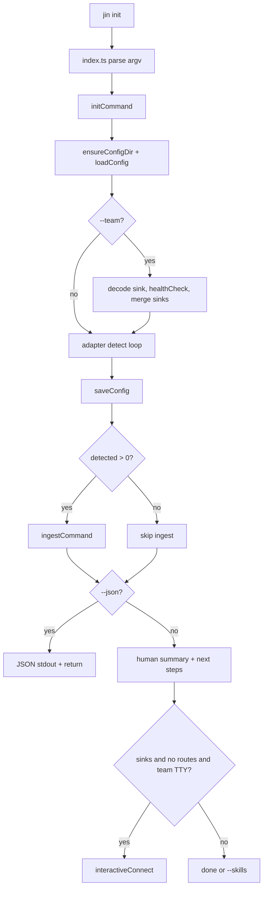

# First run: `jin init` (end-to-end)

This document ties together what happens the first time someone runs `jin init` in a clean environment. Deeper detail lives in the module-level files in this folder.

## Sequence (happy path, no flags)

1. **CLI** — Bun executes `src/index.ts` (`package.json` → `"bin": { "jin": "./src/index.ts" }`). The first argv token is the subcommand `init`; remaining tokens are parsed into `flags`.
2. **Config dir** — `ensureConfigDir()` creates the config directory if missing (typically `~/.config/jin`, or `JIN_CONFIG_DIR`, or Windows `%LOCALAPPDATA%\jin`).
3. **Load config** — `loadConfig()` returns merged `defaultConfig()` + existing `config.json` if present; on first run there is no file yet, so defaults apply (all known adapters start as `enabled: true` in the in-memory object).
4. **Optional `--team`** — If present, decodes a base64 team sink payload, merges sinks, sets `config.team`, runs a one-shot `healthCheck`, then closes the sink. Bad payload → `process.exit(1)`.
5. **Adapter sweep** — Every adapter from `allAdapters()` runs `detect()`. For each adapter: on success, session count is recorded and `config.adapters[id].enabled = true`; on failure, name goes to `notFound` and `enabled = false`. If `detect()` throws, only the name is added to `notFound`; the adapter entry may remain at its prior value (see [command-init.md](./command-init.md)).
6. **Persist** — `saveConfig()` writes `config.json`.
7. **Auto-ingest** — If at least one adapter was detected, `ingestCommand()` runs: opens SQLite at `store.dbPath`, ensures `rawDir`, ingests only adapters still `enabled` in config and passing `detect()` again, writes short-lived `jin.progress`, then `clearProgress()`.
8. **Output** — Human-readable summary, path to `config.json`, and a “Next: `jin connect`” vs “Next: `jin start`” hint depending on sinks vs routes.
9. **Optional `--skills`** — If present and execution did not return early (`--json` returns before this), installs tool-specific skill/command stubs under home directories (see `src/commands/setup-skills.ts`).

## Module-level docs

| Doc | Scope |
|-----|--------|
| [cli-entry.md](./cli-entry.md) | `src/index.ts`: argv, flags, dynamic import into `initCommand` |
| [command-init.md](./command-init.md) | `src/commands/init.ts`: orchestration, team, connect handoff, `--json` / `--skills` |
| [config-sinks-store.md](./config-sinks-store.md) | `src/config.ts`, sink encoding, paths, what appears on disk |
| [adapters-ingest.md](./adapters-ingest.md) | `src/adapters/registry.ts`, `src/commands/ingest.ts`, `src/progress.ts`, `Store` |

**After init:** watcher, routing, API, and tests — see [README.md](./README.md) for [watcher-daemon-lifecycle.md](./watcher-daemon-lifecycle.md), [routing-connect-sink-push.md](./routing-connect-sink-push.md), [adapter-claude-code.md](./adapter-claude-code.md), [api-dashboard.md](./api-dashboard.md), [testing-contracts.md](./testing-contracts.md).

## Quick diagram

## Tests as specification

Behavioral expectations for init (team sinks, duplicate skipping, auto-ingest, `--json` projects) are covered in `test/init.test.ts`.
