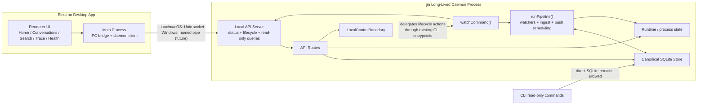
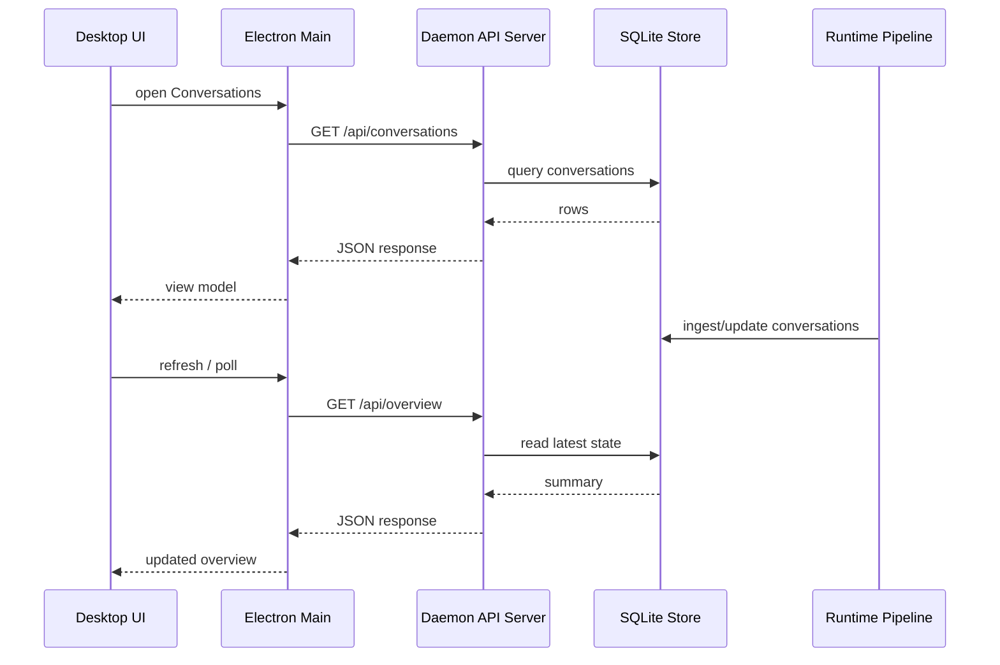

# Desktop Daemon Architecture

This note captures the current approved Desktop shape:

- `jin` daemon remains the only runtime
- Electron Desktop is a client of the daemon boundary
- the canonical store stays inside the daemon runtime
- Desktop consumes a local control/query surface instead of owning a second backend

## 1. Component Diagram

## 2. Read Query Sequence

## 3. Notes

- The API server is in-process with the daemon runtime, not a separate backend.
- Phase 1 Desktop work targets the approved daemon query boundary from `W4-DESKTOP-01`.
- Linux and macOS use the current Unix-socket boundary.
- The first release publishes Desktop only for macOS arm64, macOS x64, and Linux x64.
- Windows keeps the same architecture but still needs named-pipe transport parity before Desktop is distributed there. Track this in issue #56.

## 4. Type Contract Rule

The Desktop/daemon boundary should reuse the v2 domain model for canonical
entities instead of cloning those entities into a second DTO layer.

Use the existing v2 entity types directly for:

- `Conversation`
- `Message`
- `ToolCall`
- store/push-state entities when surfaced to Desktop

Still define explicit boundary types for responses that are product-shaped
compositions rather than single ontology objects, such as:

- overview summaries
- conversation detail views
- trace views
- tree views
- local control/status responses

Future Desktop work should also drop v1 compatibility aliases from the typed
boundary:

- no `parentSessionId`
- no mixed snake_case and camelCase duplicates
- no legacy `session` naming as the primary canonical contract
