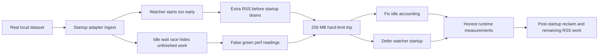

# Runtime RSS needs honest idle checks and deferred watchers

## Problem

`jin start --foreground` kept crossing the frozen `256 MB` hard limit on real local data. The easy explanation was "Claude is too big," but the live runtime failure was actually a stack of smaller problems:

- the live Claude dataset is still the heaviest startup adapter
- the default recursive watcher adds meaningful resident memory before startup ingest finishes
- runtime validation briefly overclaimed success because `PipelineHandle.waitForIdle()` could resolve before a directly handed-off work item had actually finished
- the daemon path and the narrow adapter probes were not measuring the same shape of work

Representative measurements from the live local dataset:

- built `./jin start --foreground` with sinks disabled still failed around `257 MB`
- Claude-only startup ingest with the real watcher settled around `255 MB`
- the same Claude-only startup ingest with a noop watcher settled around `236 MB`
- one representative post-startup reclaim probe dropped from roughly `252 MB` to `248 MB`

## Solution

We fixed the runtime measurement and startup shape first, not the hard limit itself.

1. Fix idle detection before trusting any runtime proof.
   `waitForIdle()` was returning early when queue work was handed directly to a waiting coordinator. That made some earlier "safe" measurements false. The queue/loop now track handed-off work explicitly and the regression lives in `test/pipeline-spine.test.ts`.

2. Stop paying watcher cost before the startup backlog drains.
   The runtime now supports `deferWatcherStart`, and the real watch path enables it. Startup ingest runs first; only after the queue drains do we reconcile and start file watchers.

3. Keep the benchmark runtime aligned with the daemon runtime.
   The benchmark runtime path now uses the same deferred-startup watcher behavior so the harness measures the real daemon shape instead of an easier synthetic one.

4. Treat idle reclaim as a distinct phase.
   The latest probes show that startup completion and stable post-startup RSS are not the same thing. Explicit SQLite/process reclaim after startup still matters.

## Key Insight

For Jin, runtime RSS is not just an adapter problem. It is the composition of:

- adapter discovery/load shape
- queue semantics
- watcher lifecycle
- SQLite resident state

Any perf claim that does not use the real pipeline shape is suspect.

## Prevention

- Keep runtime/perf validation on the built binary or an equivalent pipeline shape.
- Do not trust `waitForIdle()`-based measurements unless handed-off queue work is accounted for.
- Treat watcher startup as optional runtime overhead, not a free constant.
- Keep startup proof and steady-state proof separate in `W3-PERF-*` audits.

## Related

- `W3-PERF-04` remains the active lane for the remaining RSS closure work.
- `BP-02` owns the frozen runtime guard.
- `BP-10` owns the rule that release validation must be proven on the real path.

## Files Changed

- `src/pipeline/queue.ts`
- `src/pipeline/loop.ts`
- `src/pipeline/types.ts`
- `src/commands/watch.ts`
- `src/commands/benchmark.ts`
- `test/pipeline-spine.test.ts`
- `test/runtime-store-cutover.test.ts`
