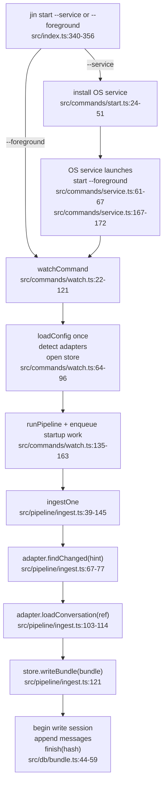
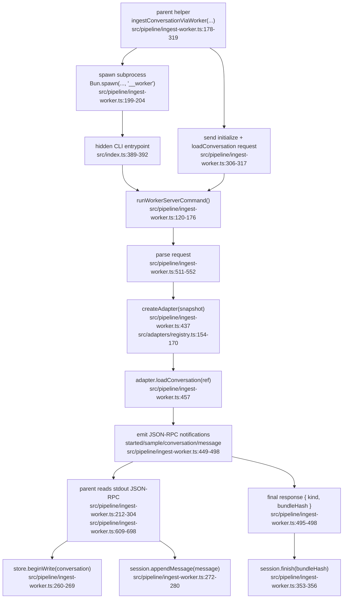

# Worker Ingest Flow Guide

This guide explains two different paths that currently coexist:

1. the **default live runtime path** that `jin start --foreground` and `jin start --service` use
2. the **worker subprocess path** that the runtime now uses by default for heavy `claude-code` and `codex` startup/periodic ingest

That distinction matters. Right now, the worker server is real, the JSON-RPC transport is real, the parent-owned config snapshot fix is real, and the parent no longer buffers a full conversation in memory before commit. The main pipeline still ingests inline for most adapters and for `fs-change` work, but it now hands heavy startup/periodic `claude-code` and `codex` work to subprocess workers by default.

---

## One Important Caveat First

The parent write session is now **disk-backed staged storage**, not an in-memory
message buffer.

- `src/db/write-session.ts`
  - `beginConversationWriteSession(...)` opens a staged session record
  - `appendMessage(...)` writes message/tool-call rows into `_jin_stage_*` tables
  - only small derived counters stay in memory
  - `finish(bundleHash)` atomically promotes staged rows into canonical tables
- `src/pipeline/ingest-worker.ts`
  - parent opens `store.beginWrite(...)`
  - parent stages each streamed message as it arrives
  - worker still computes `bundleHash` only after `loadConversation(ref)` returns
    a full bundle

So the remaining caveat is no longer parent-side full-conversation buffering.
The remaining caveat is:

- the **child** still materializes a full `ConversationBundle`
- the parent still waits for the final `bundleHash` before commit

That means the store contract is now compatible with low-memory parent writes,
but the worker path is still not true end-to-end streaming.

---

## Disk-Backed Write Session Deep Dive

This is the parent-side persistence model that replaced the old buffered
`messages: ParsedMessage[]` session.

### Why it exists

The old parent write session had a simple shape:

1. `beginWrite(conversation)`
2. `appendMessage(message)` pushes into an in-memory array
3. `finish(bundleHash)` writes everything to SQLite

That kept the store contract clean, but it reintroduced a parent memory spike.
For a large conversation, the child held the full bundle and the parent held the
same normalized messages again while waiting for `finish(bundleHash)`.

The new session keeps the same contract surface, but changes the implementation:

1. `beginWrite(conversation)` creates a staged session on disk
2. `appendMessage(message)` writes staged message/tool-call rows immediately
3. `finish(bundleHash)` atomically promotes staged rows into canonical tables
4. `abort()` deletes only that session's staged rows

### The three staged tables

The parent stages one conversation write through:

- `_jin_stage_sessions`
  - one row per in-flight write session
  - owns `session_id`, `conversation_id`, `created_at`, `staged_bytes`
- `_jin_stage_messages`
  - staged message rows for exactly one `session_id`
- `_jin_stage_tool_calls`
  - staged tool-call rows for exactly one `session_id`

This is what allows the parent to write incrementally without touching the live
`messages` and `tool_calls` tables until the final hash is known.

### Lifecycle from start to finish

#### 1. Session start

- `src/db/write-session.ts`
  - `beginConversationWriteSession(...)`
- `src/pipeline/ingest-worker.ts`
  - parent calls `store.beginWrite(conversation)` when the child emits
    `jin.ingest.conversation`

At this point the parent:

- estimates the initial conversation row size
- creates a unique `session_id`
- inserts one `_jin_stage_sessions` row
- does **not** open a long-lived write transaction for the whole worker stream

That last point matters. SQLite remains parent-owned, but the parent is not
holding a transaction open for the full lifetime of a worker.

#### 2. Message append

- `src/db/write-session.ts`
  - `appendMessage(message)`

For each message, the parent:

1. estimates message/tool-call bytes
2. enforces the staged safety limit
3. starts a short local SQLite transaction
4. inserts one staged message row
5. inserts staged tool-call rows
6. updates `_jin_stage_sessions.staged_bytes`
7. updates small in-memory derived counters only

Important distinction:

- large message bodies go to SQLite-backed staging rows
- only small aggregates stay in memory:
  - message count
  - tool count
  - token totals
  - cost estimate
  - staged byte counter

So the parent memory profile is now:

- one current message object
- small counters
- SQLite-backed staged rows on disk

not:

- one giant `ParsedMessage[]`

#### 3. Finish

- `src/db/write-session.ts`
  - `finish(bundleHash)`
  - `applyStagedConversationWrite(...)`

When the child returns the final hash, the parent starts the canonical commit:

1. `BEGIN IMMEDIATE`
2. read previous sync state
3. if hash unchanged:
   - delete staged rows
   - update `ingestedAt`
   - commit
4. if hash changed:
   - upsert the conversation row
   - delete canonical `messages` / `tool_calls` for that conversation
   - copy staged rows into canonical tables in stable order
   - refresh FTS
   - persist derived fields
   - upsert `_jin_sync`
   - delete staged rows
   - commit

So the staged tables are not the final store. They are a disk-backed landing
area that preserves atomicity until the hash gate is resolved.

#### 4. Abort

- `src/db/write-session.ts`
  - `abort()`
  - `abortConversationWriteSession(...)`

Abort deletes only rows for that one `session_id`.

That matters because multiple staged sessions for the same conversation can
exist transiently. The bug we already fixed in this lane was exactly here:
session cleanup must be scoped to `session_id`, not `conversation_id`, or one
session can wipe another session's staged rows.

### Why the parent does not write directly into canonical tables on append

Because `finish(bundleHash)` is still the commit gate.

Today the parent does not know whether the conversation is changed until it sees
the final canonical bundle hash. If the parent wrote directly to canonical
tables on every `appendMessage(...)`, it would need to:

- keep a long transaction open across IPC, or
- mutate live rows before the unchanged-hash decision, or
- invent a second rollback/recovery mechanism outside the store contract

The staged-table design avoids all three.

### What remains in memory anyway

The parent is no longer the main problem, but it is not literally zero-memory:

- current `ParsedMessage` object being appended
- derived counters
- session metadata

The remaining large memory term is still in the **child**, because the child
still calls `adapter.loadConversation(ref)` and materializes a full
`ConversationBundle` before it starts emitting notifications.

### Mental model

Think of the parent write session as:

- not a buffer of messages
- not direct writes to the final tables
- a disk-backed write-ahead staging area for one conversation

That is the key concept.

---

## A. Live Runtime By Default

This is the path that actually runs now.

### Step A1: CLI entry

- `src/index.ts:340-356`
  - `jin start --foreground` dispatches to `watchCommand({ daemon: false })`
  - `jin start --service` dispatches to `startCommand({ service: true })`

### Step A2: Service install path

- `src/commands/start.ts:24-51`
  - `startCommand({ service: true })` installs the OS service via `serviceCommand("install")`
- `src/commands/service.ts:61-67`
  - Linux systemd unit runs: `ExecStart=${binPath} start --foreground`
- `src/commands/service.ts:167-172`
  - macOS launchd plist runs: `${binPath} start --foreground`

So service mode does **not** ingest directly. It installs a manager that later launches the same foreground runtime.

### Step A3: Runtime boot

- `src/commands/watch.ts:64-70`
  - load config once
  - create sinks
  - detect active adapters
- `src/commands/watch.ts:95-120`
  - open SQLite store
  - start pipeline

### Step A4: Pipeline startup scheduling

- `src/commands/watch.ts:135-163`
  - `runPipeline(...)`
  - startup scheduling is still caller-owned here
  - `watch.ts` manually enqueues one `ingest-adapter` work item per detected adapter

### Step A5: Actual ingest work by default

- `src/pipeline/ingest.ts:67-77`
  - `adapter.findChanged(hint)` returns `ConversationRef[]`
- `src/pipeline/ingest.ts`
  - for each ref:
    - heavy `claude-code` / `codex` startup and periodic scans use
      `ingestConversationViaWorker(...)`
    - other adapters and `fs-change` work stay inline with:
      - `adapter.loadConversation(ref)`
      - `store.writeBundle(bundle)`

### Step A6: Store write path today

- `src/db/store.ts:60-67`
  - store exposes both `writeBundle(...)` and `beginWrite(...)`
- `src/db/bundle.ts:44-59`
  - `writeBundle(...)` is now a wrapper
  - it opens a store write session
  - appends ordered messages
  - computes canonical bundle hash
  - finishes the session

### Live Runtime Diagram

---

## B. Worker Path For Heavy Scan Work

This path is implemented, tested, and BP-aligned at the transport/ownership
layer. It is now the default for heavy `claude-code` and `codex` startup and
periodic ingest.

### Step B1: Parent helper exists

- `src/pipeline/ingest-worker.ts:178-319`
  - `ingestConversationViaWorker(...)`
  - parent spawns a subprocess using:
    - `Bun.spawn({ cmd: [...workerCommand, "__worker"], stdin: "pipe", stdout: "pipe", stderr: "pipe" })`
  - this is the actual subprocess fork/spawn point

### Step B2: Hidden worker entrypoint

- `src/index.ts:389-392`
  - hidden internal command is now `__worker`
  - old `__worker-ingest-ref` is gone

### Step B3: Child worker server starts

- `src/pipeline/ingest-worker.ts:120-176`
  - `runWorkerServerCommand()`
  - reads JSON-RPC messages from `Bun.stdin.stream()`
  - handles:
    - `initialize`
    - `jin.ingest.loadConversation`

### Step B4: Parent sends a config snapshot, not disk config

- `src/pipeline/ingest-worker.ts:306-317`
  - parent sends JSON-RPC requests
- `src/pipeline/ingest-worker.ts:511-552`
  - child parses a `WorkerLoadConversationRequest`
  - request contains:
    - `ref`
    - `adapter.adapterId`
    - `adapter.adapterConfig`

There is **no** worker-side `loadConfig()` anymore.

### Step B5: Child reconstructs adapter from parent snapshot

- `src/pipeline/ingest-worker.ts:430-447`
  - child validates adapter id matches the ref
  - child calls `createAdapter(adapter.adapterId, adapter.adapterConfig)`
- `src/adapters/registry.ts:154-170`
  - `createAdapter(...)` resolves the adapter using the parent-provided config snapshot

This fixes the earlier smell where the child reread disk config mid-run.

### Step B6: Child loads the full bundle

- `src/pipeline/ingest-worker.ts:457`
  - child still does `v2Adapter.loadConversation(ref)`

This is critical:

- the child still materializes a full `ConversationBundle`
- only after that does it begin sending normalized data back

So the worker transport helps the parent stay smaller, but it does **not** yet remove the child peak.

### Step B7: Child emits JSON-RPC notifications

- `src/pipeline/ingest-worker.ts:449-455`
  - `jin.worker.started`
- `src/pipeline/ingest-worker.ts:455, 483, 494, 583-593`
  - `jin.worker.sample`
- `src/pipeline/ingest-worker.ts:468-472`
  - `jin.ingest.conversation`
- `src/pipeline/ingest-worker.ts:476-485`
  - `jin.ingest.message`
- `src/pipeline/ingest-worker.ts:460-465`
  - `jin.ingest.missing`
- `src/pipeline/ingest-worker.ts:495-498`
  - final JSON-RPC response includes `bundleHash`

### Step B8: Parent consumes notifications and writes

- `src/pipeline/ingest-worker.ts:212-304`
  - parent reads JSON-RPC responses and notifications from child stdout
- `src/pipeline/ingest-worker.ts:260-269`
  - on `jin.ingest.conversation`, parent calls `store.beginWrite(...)`
- `src/pipeline/ingest-worker.ts:272-280`
  - on `jin.ingest.message`, parent calls `session.appendMessage(...)`
- `src/pipeline/ingest-worker.ts:320-376`
  - parent waits for final response, then calls `session.finish(bundleHash)`

### Step B9: JSON-RPC framing details

- `src/pipeline/ingest-worker.ts:596-607`
  - every message is written as:
    - `Content-Length: <bytes>\r\n\r\n<json>`
- `src/pipeline/ingest-worker.ts:609-698`
  - parser reads byte stream, finds header terminator, parses `Content-Length`, then parses JSON body

This is now the approved protocol direction from BP-02/BP-04, not the older NDJSON/frame hack.

### Worker Path Diagram

---

## C. Why The Child Still Peaks

This is now the real caveat.

### What no longer happens

- the parent no longer stores a full `ParsedMessage[]`
- `appendMessage(...)` stages rows to SQLite-backed `_jin_stage_messages` and
  `_jin_stage_tool_calls`

### What still happens

The current worker protocol still needs the final hash from the child:

- `src/pipeline/ingest-worker.ts:474`
  - worker computes `bundleHash = computeBundleHash(bundle)`
- `src/pipeline/ingest-worker.ts:495-498`
  - final RPC result returns that hash
- `src/pipeline/ingest-worker.ts:353-356`
  - parent cannot finish the store session until it has that hash

So the parent can:

- open the write session early
- append messages incrementally

But it cannot yet:

- finalize incrementally
- or apply rows directly to SQLite as they stream in

because the session commit point is currently tied to the final canonical hash.

### Practical implication

Current state:

- better contract shape
- better pipeline/store ownership
- correct JSON-RPC transport
- fixed config snapshot ownership
- disk-backed parent staging instead of parent-side full-message buffering
- **still not the final child-side low-memory path**

The next memory-focused refinement, if we choose to do it later, is:

- batch worker notifications
- move hash ownership to a rolling canonical encoder at the parent/store boundary
- and/or make the worker emit incrementally before building a full bundle

---

## D. Current Truth Summary

### What is true now

- `__worker-ingest-ref` is gone
- the hidden internal entrypoint is now generic `__worker`
- worker transport is JSON-RPC 2.0 over stdio with `Content-Length`
- worker no longer rereads config from disk
- worker reconstructs adapter from a parent-provided snapshot
- bundle and session writes now converge on one canonical store-owned write engine
- parent write sessions stage rows on disk instead of buffering full
  conversations in memory
- heavy `claude-code` / `codex` startup and periodic ingest use workers by
  default

### What is not true yet

- not every adapter uses workers
- `fs-change` work still stays inline
- the child still builds a full `ConversationBundle` before emitting message notifications

That is the honest state of the system today.
